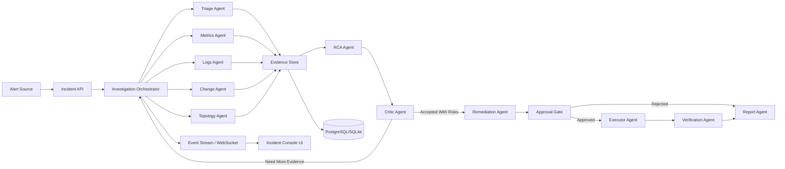
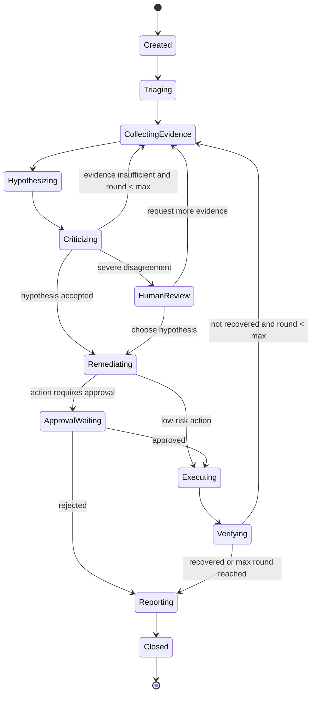

# 问题定位与处置生产流多 Agent 系统详细设计方案

## 1. 方案摘要

本方案设计一个面向生产故障定位与处置的多 Agent 协作/对抗系统，暂定名为：

IncidentOps Arena：面向生产故障定位与处置的多 Agent 协作/对抗系统

系统围绕一个真实生产流展开：当服务出现告警后，多个 Agent 分别从告警、指标、日志、变更、拓扑、历史知识库中收集证据，根因 Agent 生成候选根因，质疑 Agent 对候选根因进行反证审查，处置 Agent 生成分级处置方案，审批/执行 Agent 在人工确认后执行低风险恢复动作，验证 Agent 复查恢复效果，最终生成 RCA 报告和演示记录。

本方案以 Aurora 为重要参考，但不建议一开始完整二开 Aurora。推荐采用“双路径”策略：

1. 优先参考 Aurora 的产品形态、Agent investigation 流程、工具集成分层和 WebSocket 实时输出方式。
2. 首期 Demo 用轻量自研最小闭环实现，保留未来裁剪 Aurora 或复用 Aurora connector 的空间。

这样可以兼顾参赛要求的可运行性、可控性和多 Agent 对抗亮点，避免把周期消耗在重依赖系统裁剪上。

## 2. 课题要求映射

| **课题要求** | **本方案对应设计** |
|---|---|
| 至少 3 个不同角色 Agent | 设计 9 类 Agent：Triage、Metrics、Logs、Change、Topology、RCA、Critic、Remediation、Verification/Report |
| 每个 Agent 有清晰职责边界 | 每个 Agent 只处理一种证据或决策环节，通过结构化 Evidence/Hypothesis/Action 交接 |
| Agent 之间有明确任务流转机制 | 使用 InvestigationRun 状态机，编排 fan-out 采集、fan-in 归因、critic 回环、approval gate |
| 至少一个对抗/质疑环节 | Critic Agent 对 Top-N 根因做反证审查；Risk Agent 对处置动作做风险审查 |
| 最终输出优于单 Agent | 用证据完整度、Top-1/Top-3 准确率、误判率、MTTA、人工步骤数对比 |
| 可运行、可演示 | 本地 Docker Compose 提供 API 服务、PostgreSQL、Prometheus、traffic generator、故障注入脚本和前端 |
| 至少 1 个完整业务场景 | 设计“订单 API 500 与 P99 延迟升高”完整演示脚本 |
| 进阶：多轮协商 | Critic Agent 可要求补采样，最多 2 轮 Evidence Collection |
| 进阶：冲突处理 | 仲裁策略按证据权重、反证数量、时间相关性和人工标注决定 |
| 进阶：置信度评估 | 每个根因假设输出 score/confidence/evidence coverage |
| 进阶：人工介入 | 中高风险处置动作进入 Approval Gate |
| 进阶：真实数据/接口 | 首期接 Prometheus API、Docker logs、Git history/mock deploy events、runbook KB |

## 3. 设计原则

1. 证据先于结论：任何根因判断都必须绑定指标、日志、变更、拓扑或历史案例证据。
2. 并行收集，集中归因：采集型 Agent 并行执行，归因和处置阶段串行收敛。
3. 对抗不是装饰：Critic Agent 需要有否决权或补采样权，不能只写一句“建议谨慎”。
4. 只读自动，写入审批：调查工具默认自动执行，处置工具按风险分级进入人工确认。
5. 过程可观察：前端必须展示 Agent 时间线、中间证据、冲突点、补采样原因和最终证据链。
6. Demo 可复现：每个故障样例有固定注入方式、预期根因、预期恢复动作和评分脚本。
7. 可替换框架：Agent 编排层不强绑定 Aurora，保持 LangGraph/OpenAI Agents SDK/CAMEL 可替换空间。

## 4. Aurora 参考与裁剪策略

### 4.1 可借鉴能力

Aurora 是开源的 AI-powered agentic incident management / root cause analysis 工具，公开资料显示它使用 LangGraph agents，提供 Ask Mode 和 Agent Mode，支持查询 logs、metrics、infrastructure state，并集成云厂商、Datadog、Grafana、PagerDuty、Slack、Kubernetes 等生产系统。Aurora GitHub 当前显示 license 为 Apache-2.0，技术栈包含 Python、Next.js、PostgreSQL、Redis、Weaviate、Memgraph、Vault、Docker Compose 等。

对本方案最有价值的借鉴点：

- Incident investigation 的产品抽象：Incident、Investigation、Message、Action、Report。
- Agent Mode 的交互形态：系统自动推进调查，并通过实时消息展示过程。
- 工具生态分层：可观测工具、云资源工具、协作工具、知识库工具。
- 后端/前端分离：后端执行 Agent workflow，前端通过 WebSocket 展示流式进度。
- 容器化部署：用 Docker Compose 把 Demo 环境一次性拉起。

### 4.2 不直接完整二开的原因

Aurora 是更完整的产品底座，而参赛 Demo 更需要稳定、聚焦、可解释。完整二开可能带来：

- 依赖组件较多，部署和排障成本高。
- 云厂商和 SaaS connector 需要密钥，现场演示稳定性较差。
- 原项目通用能力较多，比赛所需的“对抗机制、评分、可重复故障样例”仍要自己补。
- 如果只改 UI 或提示词，容易被认为不是围绕课题定制的系统能力。

### 4.3 推荐裁剪方式

首期不要 fork 后大改，而是“借鉴架构 + 兼容抽象 + 局部复用”：

| **Aurora 能力** | **本方案处理方式** |
|---|---|
| LangGraph agents | 参考其状态图思想，自建 Investigation Graph |
| Ask/Agent 模式 | 保留“人工追问”和“自动调查”两个入口 |
| WebSocket chatbot | 自建事件流 InvestigationEvent，前端展示 Agent 时间线 |
| 30+ 工具集成 | 首期只做 Prometheus、Docker logs、Git/mock deploy、runbook KB |
| PostgreSQL/Redis/Weaviate/Memgraph | 首期 SQLite 或 PostgreSQL 即可；向量库和图数据库留扩展位 |
| Cloud/Kubernetes connectors | 作为二期增强，不放进首期关键路径 |
| Incident report | 自建结构化 RCA report，可导出 Markdown |

### 4.4 Aurora Spike 决策门

如果团队希望评估是否直接基于 Aurora，应先安排 1 天 spike：

| **检查项** | **通过标准** | **决策** |
|---|---|---|
| 本地启动 | docker compose up 后前后端可访问 | 通过则继续看源码结构 |
| 最小 incident 创建 | 能从 UI 或 API 创建 investigation | 通过则验证自定义工具 |
| 自定义工具接入 | 能加入 Prometheus/mock logs 查询 | 通过则考虑裁剪二开 |
| Agent 流程修改 | 能插入 Critic Agent 和 Approval Gate | 通过则走 Aurora 裁剪路线 |
| 依赖复杂度 | 关键路径不超过 PostgreSQL/Redis/前后端 | 不通过则切回自研最小闭环 |

结论：Aurora 可以作为参考和备选二开对象，但本课题推荐先实现轻量闭环，避免依赖复杂度盖过方案亮点。

## 5. 系统目标与非目标

### 5.1 系统目标

- 自动接收告警并生成调查计划。
- 并行采集指标、日志、变更、拓扑、历史案例证据。
- 对候选根因进行多轮质疑、反驳和补采样。
- 输出可解释的根因排序、置信度和证据链。
- 生成分级处置建议，区分自动、需审批、禁止执行动作。
- 支持至少一个完整可复现业务故障演示。
- 支持与单 Agent baseline 做质量和效率对比。

### 5.2 非目标

- 首期不做真实生产自动修复。
- 首期不接入所有云厂商和 SaaS 工具。
- 首期不追求复杂知识图谱和全量向量库。
- 首期不把 Agent 直接暴露为无限权限 Shell。
- 首期不做泛化到所有运维场景的“万能 SRE”。

## 6. 典型业务场景

### 6.1 演示场景：订单 API 500 与 P99 延迟升高

业务系统：

- order-api：FastAPI 服务，提供下单、查询订单接口。
- postgres：订单数据库。
- traffic-generator：持续产生正常流量和峰值流量。
- prometheus：采集 API 请求数、错误率、P99 延迟、DB pool 使用率。
- incident-console：前端展示调查过程。

故障注入：

1. 发布配置变更：DB_POOL_SIZE=2，低于正常值 20。
2. traffic generator 提高并发。
3. order-api 开始出现 DB connection timeout。
4. Prometheus 触发告警：OrderApiHighErrorRate 和 OrderApiHighLatency。

预期根因：

近期配置变更将 order-api 的数据库连接池从 20 降到 2，在流量升高后连接池耗尽，导致请求排队、P99 延迟升高，并出现 500 错误。

预期处置：

- 低风险：降低 traffic generator 压力，仅用于 Demo。
- 中风险：将 DB_POOL_SIZE 恢复到 20 并滚动重启 order-api。
- 高风险：数据库参数调整或批量重启，不在 Demo 自动执行。

### 6.2 演示价值

这个场景能同时展示：

- 指标异常：错误率、P99、DB pool saturation 同时变化。
- 日志证据：connection timeout/too many clients。
- 变更证据：配置变更和故障时间相关。
- 对抗价值：Critic Agent 会排除“单纯流量突增”“数据库宕机”“应用代码 bug”等替代假设。
- 处置闭环：恢复配置后验证指标回落，生成 RCA 报告。

## 7. 总体架构



### 7.1 模块划分

| **模块** | **职责** |
|---|---|
| Incident API | 接收告警、查询调查记录、审批动作、导出报告 |
| Investigation Orchestrator | 管理状态机、Agent 调度、超时、重试、回合限制 |
| Agent Runtime | 执行各角色 Agent，支持工具调用和结构化输出 |
| Tool Registry | 管理 Prometheus、Logs、Git、Runbook、Docker 等工具 |
| Evidence Store | 存储证据、假设、反证、动作、评分、事件流 |
| Policy Engine | 判断工具权限、动作风险和审批要求 |
| Incident Console UI | 展示告警、Agent 时间线、证据、根因、审批、报告 |
| Evaluation Runner | 批量运行故障样例，对比单 Agent 和多 Agent 指标 |

### 7.2 技术栈建议

| **层次** | **首选** | **备选** |
|---|---|---|
| 后端 | Python + FastAPI | Flask，如果基于 Aurora 裁剪 |
| Agent 编排 | LangGraph | OpenAI Agents SDK、CAMEL |
| 前端 | Next.js + TypeScript | Streamlit，用于更快 Demo |
| 数据库 | SQLite 首期，PostgreSQL 二期 | Aurora 路线沿用 PostgreSQL |
| 事件推送 | WebSocket / Server-Sent Events | 轮询 |
| 指标 | Prometheus | Mock metrics provider |
| 日志 | Docker logs / 本地 JSONL | Loki / Elasticsearch |
| 变更 | Git history + mock deploy events | GitHub Actions / ArgoCD |
| 知识库 | Markdown runbooks + SQLite FTS | 向量库 |
| 部署 | Docker Compose | 本地脚本 |

## 8. Agent 角色设计

### 8.1 Triage Agent：告警分诊

输入：

- Alert JSON
- 服务拓扑元数据
- 告警规则说明

职责：

- 判断告警级别、影响服务、起止时间窗。
- 生成调查计划。
- 决定需要并行启动哪些 Evidence Agent。

输出：

```json
{
  "incident_id": "inc-20260726-001",
  "severity": "P1",
  "service": "order-api",
  "time_window": {
    "start": "2026-07-26T10:00:00+08:00",
    "end": "2026-07-26T10:20:00+08:00"
  },
  "investigation_plan": [
    "check_error_rate",
    "check_p99_latency",
    "check_db_pool",
    "check_recent_deployments",
    "check_exception_logs"
  ]
}
```

边界：

- 不直接判断最终根因。
- 不执行处置动作。

### 8.2 Metrics Agent：指标分析

输入：

- incident time window
- service name
- Prometheus query templates

职责：

- 查询错误率、延迟、吞吐、资源饱和度、DB 连接池等指标。
- 找到异常开始时间和指标间相关性。
- 输出指标证据和简短判断。

工具：

- prometheus_range_query(query, start, end, step)
- prometheus_instant_query(query, time)

输出：

```json
{
  "agent": "metrics",
  "evidence_type": "metric",
  "summary": "order-api error rate rose from 0.2% to 18% after 10:07; DB pool usage reached 100%",
  "supporting_signals": [
    "http_5xx_rate",
    "http_request_duration_p99",
    "db_pool_in_use"
  ],
  "confidence": 0.86
}
```

边界：

- 只输出指标事实和异常相关性。
- 不把相关性直接写成因果结论。

### 8.3 Logs Agent：日志分析

输入：

- service name
- time window
- error keywords

职责：

- 查询应用日志、容器日志和异常堆栈。
- 聚类高频错误。
- 提供与指标异常同时间段相关的日志样本。

工具：

- docker_logs(service, since, until, limit)
- search_logs(service, query, start, end, limit)
- cluster_errors(log_lines)

输出：

```json
{
  "agent": "logs",
  "evidence_type": "log",
  "summary": "most 500 responses contain database connection timeout",
  "top_errors": [
    {
      "message": "db connection timeout after 3000ms",
      "count": 184,
      "first_seen": "2026-07-26T10:07:12+08:00"
    }
  ],
  "confidence": 0.82
}
```

边界：

- 不读取无关服务的大量日志。
- 单次日志返回要限时窗、限行数、限 token。

### 8.4 Change Agent：变更分析

输入：

- service name
- time window
- deploy history
- Git commit/config diff

职责：

- 查询故障前后发布、配置、依赖、基础设施变更。
- 判断变更与异常时间是否吻合。
- 标记可疑变更，并输出 diff 摘要。

工具：

- list_deployments(service, start, end)
- git_diff(commit_a, commit_b)
- read_config(service)

输出：

```json
{
  "agent": "change",
  "evidence_type": "change",
  "summary": "DB_POOL_SIZE changed from 20 to 2 at 10:05",
  "changes": [
    {
      "type": "config",
      "key": "DB_POOL_SIZE",
      "old": "20",
      "new": "2",
      "deployed_at": "2026-07-26T10:05:30+08:00"
    }
  ],
  "confidence": 0.9
}
```

边界：

- 不直接回滚。
- 对 commit 内容只做摘要，不把代码片段无限塞进上下文。

### 8.5 Topology Agent：拓扑与影响面分析

输入：

- service catalog
- dependency map
- metrics summary

职责：

- 识别故障服务、上下游依赖和影响范围。
- 判断异常是否沿调用链传播。
- 帮助区分根因服务和受害服务。

工具：

- get_service_dependencies(service)
- get_call_graph(service, time_window)

输出：

```json
{
  "agent": "topology",
  "evidence_type": "topology",
  "summary": "order-api is the first service with error spike; payment-api only shows reduced traffic, not upstream errors",
  "blast_radius": ["order-api", "checkout-web"],
  "likely_source_services": ["order-api"],
  "confidence": 0.74
}
```

边界：

- 不替代 Metrics/Logs 的具体证据。

### 8.6 RCA Agent：根因判断

输入：

- Evidence Store 中所有 evidence
- historical incidents
- runbook

职责：

- 生成 Top-N 根因假设。
- 为每个假设绑定支持证据、反证、缺失证据。
- 给出置信度和建议补采样项。

输出：

```json
{
  "hypotheses": [
    {
      "id": "h1",
      "root_cause": "DB connection pool size was reduced from 20 to 2, causing pool exhaustion",
      "score": 0.88,
      "supporting_evidence_ids": ["e-metrics-001", "e-logs-002", "e-change-001"],
      "counter_evidence_ids": [],
      "missing_evidence": ["verify recovery after restoring DB_POOL_SIZE"]
    },
    {
      "id": "h2",
      "root_cause": "Traffic spike overloaded order-api",
      "score": 0.46,
      "supporting_evidence_ids": ["e-metrics-003"],
      "counter_evidence_ids": ["e-change-001"],
      "missing_evidence": ["compare traffic level with previous normal peak"]
    }
  ]
}
```

边界：

- 不能输出没有 evidence id 的根因。
- 不能跳过 Critic Agent。

### 8.7 Critic Agent：质疑与反证

输入：

- RCA hypotheses
- Evidence Store
- policy rules

职责：

- 逐条挑战根因假设。
- 找时间线冲突、指标/日志不一致、证据不足、替代解释。
- 判断是否需要补采样。
- 对根因给出 accept/revise/reject。

输出：

```json
{
  "verdict": "revise",
  "critiques": [
    {
      "hypothesis_id": "h1",
      "issue": "need to verify whether traffic spike alone could explain saturation",
      "required_actions": [
        "query historical traffic peak",
        "compare db_pool_in_use before config change"
      ]
    }
  ],
  "next_step": "collect_more_evidence"
}
```

对抗规则：

- 至少提出一个替代假设，除非证据已覆盖指标、日志、变更、拓扑四类。
- 如果最高分根因缺少变更证据或恢复验证，不能直接进入 final report。
- 如果处置动作为中高风险，必须进入风险审查和人工审批。

### 8.8 Remediation Agent：处置建议

输入：

- accepted hypothesis
- runbook
- policy rules
- current system state

职责：

- 生成多级处置方案：观察、缓解、修复、回滚、复盘。
- 标注动作风险、前置条件、执行命令、回滚方案。
- 给出推荐动作和理由。

输出：

```json
{
  "recommended_actions": [
    {
      "id": "a1",
      "title": "Restore DB_POOL_SIZE to 20",
      "risk": "medium",
      "command": "set_config order-api DB_POOL_SIZE 20",
      "requires_approval": true,
      "rollback": "set_config order-api DB_POOL_SIZE 2",
      "expected_effect": "reduce DB connection wait time and lower 5xx rate"
    }
  ]
}
```

边界：

- 不直接执行中高风险动作。
- 必须为每个动作生成验证步骤。

### 8.9 Approval/Executor Agent：审批与执行

输入：

- proposed action
- approval decision
- policy rules

职责：

- 根据风险策略判断是否允许自动执行。
- 将待审批动作展示给人工。
- 执行被批准的 allowlist 命令。
- 记录审计日志。

工具：

- set_config(service, key, value)
- restart_service(service)
- scale_service(service, replicas)
- create_ticket(payload)

安全边界：

- 禁止任意 shell。
- 禁止数据库写 SQL。
- 禁止跨服务批量操作。
- 禁止无审批执行 rollback/restart/scale。

### 8.10 Verification Agent：恢复验证

输入：

- executed actions
- validation queries
- time window after action

职责：

- 复查错误率、P99、DB pool、日志错误量。
- 判断是否恢复或需要继续调查。
- 输出恢复证据。

输出：

```json
{
  "status": "recovered",
  "validation_summary": "5xx rate dropped from 18% to 0.3%; p99 latency dropped from 2200ms to 180ms",
  "evidence_ids": ["e-verify-001", "e-verify-002"]
}
```

### 8.11 Report Agent：报告生成

输入：

- incident summary
- evidence
- hypotheses
- critiques
- actions
- verification result

职责：

- 生成 RCA 报告。
- 生成比赛演示摘要。
- 生成单 Agent vs 多 Agent 对比数据。

报告字段：

- 故障摘要
- 影响范围
- 时间线
- 根因结论
- 证据链
- 被排除的替代假设
- 处置动作
- 恢复验证
- 后续改进
- 多 Agent 协作价值

## 9. Agent 信息协议

为了让 Agent 间协作可控，所有中间结果都用结构化对象传递，不依赖自然语言长上下文。

### 9.1 InvestigationRun

```json
{
  "incident_id": "inc-20260726-001",
  "status": "triage|collecting|hypothesizing|criticizing|remediating|approval_waiting|executing|verifying|reporting|closed",
  "severity": "P1",
  "service": "order-api",
  "time_window": {
    "start": "2026-07-26T10:00:00+08:00",
    "end": "2026-07-26T10:20:00+08:00"
  },
  "round": 1,
  "max_rounds": 3
}
```

### 9.2 Evidence

```json
{
  "id": "e-metrics-001",
  "incident_id": "inc-20260726-001",
  "source": "prometheus",
  "agent": "metrics",
  "type": "metric|log|change|topology|runbook|verification",
  "time_range": "2026-07-26T10:00:00+08:00/2026-07-26T10:20:00+08:00",
  "summary": "DB pool usage reached 100% after 10:07",
  "raw_ref": "promql:db_pool_in_use/order-api",
  "confidence": 0.86
}
```

### 9.3 Hypothesis

```json
{
  "id": "h1",
  "incident_id": "inc-20260726-001",
  "claim": "DB_POOL_SIZE reduction caused connection exhaustion",
  "score": 0.88,
  "supporting_evidence_ids": ["e-metrics-001", "e-logs-001", "e-change-001"],
  "counter_evidence_ids": [],
  "missing_evidence": ["post-remediation validation"],
  "status": "proposed|challenged|accepted|rejected"
}
```

### 9.4 Critique

```json
{
  "id": "c1",
  "hypothesis_id": "h1",
  "verdict": "accept|revise|reject",
  "risk": "low|medium|high",
  "challenge": "traffic spike may be a sufficient alternative explanation",
  "required_evidence": ["historical_peak_traffic", "pre_change_pool_usage"],
  "next_step": "collect_more_evidence|remediate|report"
}
```

### 9.5 Action

```json
{
  "id": "a1",
  "incident_id": "inc-20260726-001",
  "title": "Restore DB_POOL_SIZE to 20",
  "risk": "medium",
  "tool": "set_config",
  "args": {
    "service": "order-api",
    "key": "DB_POOL_SIZE",
    "value": "20"
  },
  "requires_approval": true,
  "status": "proposed|approved|executed|failed|rejected",
  "rollback": {
    "tool": "set_config",
    "args": {
      "service": "order-api",
      "key": "DB_POOL_SIZE",
      "value": "2"
    }
  }
}
```

## 10. 编排状态机



关键约束：

- max_rounds 首期设为 3，防止无限循环。
- 每轮最多产生 3 个根因假设。
- 每个假设至少绑定 2 类证据，否则不能进入处置阶段。
- Critic Agent 至少执行 1 次。
- 中高风险动作必须经过 ApprovalWaiting。

## 11. 工具与权限设计

### 11.1 工具清单

| **工具** | **类型** | **调用方** | **风险** | **首期实现** |
|---|---|---|---|---|
| prometheus_range_query | 只读 | Metrics/Verification | 低 | Prometheus HTTP API |
| docker_logs | 只读 | Logs | 低 | Docker CLI 或 Docker SDK |
| list_deployments | 只读 | Change | 低 | mock JSON + Git log |
| git_diff_summary | 只读 | Change | 低 | 本地 Git |
| get_service_dependencies | 只读 | Topology | 低 | YAML service catalog |
| search_runbook | 只读 | RCA/Remediation | 低 | Markdown + SQLite FTS |
| set_config | 写入 | Executor | 中 | allowlist key |
| restart_service | 写入 | Executor | 中 | allowlist service |
| scale_service | 写入 | Executor | 中 | allowlist range |
| create_ticket | 写入 | Report/Executor | 低 | 本地 mock ticket |

### 11.2 权限策略

```yaml
policy:
  read_tools:
    auto_allowed: true
  write_tools:
    auto_allowed: false
    require_approval: true
  allowed_services:
    - order-api
    - payment-api
    - inventory-api
  allowed_config_keys:
    - DB_POOL_SIZE
    - FEATURE_FLAG_SAFE_MODE
    - RATE_LIMIT_QPS
  forbidden:
    - arbitrary_shell
    - database_write_sql
    - delete_resource
    - cross_service_bulk_restart
```

## 12. 根因评分与仲裁

### 12.1 评分模型

根因假设得分由证据权重和反证惩罚组成：

```text
score =
  0.30 * metric_alignment
+ 0.25 * log_alignment
+ 0.20 * change_correlation
+ 0.10 * topology_plausibility
+ 0.10 * historical_similarity
+ 0.05 * remediation_verifiability
- 0.20 * unresolved_counter_evidence
```

评分说明：

- metric_alignment：异常指标是否与假设机制一致。
- log_alignment：日志错误是否能解释用户影响。
- change_correlation：变更时间是否早于异常，且变更内容具备因果可能。
- topology_plausibility：拓扑上是否能解释影响面。
- historical_similarity：是否命中历史同类事故。
- remediation_verifiability：是否能通过低风险动作验证。
- unresolved_counter_evidence：仍未解释的反证数量和强度。

### 12.2 冲突处理

| **冲突类型** | **处理策略** |
|---|---|
| 指标支持 A，日志支持 B | 增加时间线对齐采样，比较 first_seen 与 abnormal_start |
| 变更时间吻合但日志不吻合 | 降低 change 权重，要求 Logs Agent 扩大关键字或服务范围 |
| Top-1 与 Top-2 分差小于 0.15 | 进入 HumanReview 或要求补采样 |
| Critic reject Top-1 | RCA Agent 必须重排 Top-N，并记录被拒原因 |
| 恢复验证失败 | 回到 CollectingEvidence，标记原假设为 challenged |

### 12.3 进入最终结论的门槛

- Top-1 score >= 0.75。
- 至少包含指标和日志两类证据。
- 如果最近 30 分钟内有变更，必须包含 Change Agent 结论。
- Critic verdict 必须是 accept 或 accept_with_risk。
- 若执行了处置动作，必须包含 Verification Agent 结果。

## 13. 前端演示设计

### 13.1 页面结构

首期只需要一个可演示的工作台，不做营销式首页。

| **区域** | **内容** |
|---|---|
| 左侧 Incident 列表 | 告警名称、服务、级别、状态、开始时间 |
| 顶部摘要栏 | 当前 incident、影响面、Top-1 根因、置信度、恢复状态 |
| 中央 Agent Timeline | 每个 Agent 的开始/完成/工具调用/输出摘要 |
| 右侧 Evidence Panel | 指标图、日志样本、变更 diff、拓扑信息 |
| 下方 Decision Panel | Top-N 根因、Critic 反驳、处置动作、审批按钮 |
| Report Tab | RCA Markdown、演示摘要、对比指标 |

### 13.2 演示时必须让评委看到的内容

- 多个 Agent 是并行或分阶段运行的，不是一个长提示词。
- 每个 Agent 输出结构化证据。
- Critic Agent 明确提出质疑，并触发补采样或修正。
- 高风险动作没有被自动执行，而是进入审批。
- 恢复动作后有验证证据。
- 最终报告能解释“为什么不是其他根因”。

## 14. 后端 API 草案

### 14.1 创建调查

```http
POST /api/incidents
Content-Type: application/json

{
  "alert_name": "OrderApiHighErrorRate",
  "service": "order-api",
  "severity": "P1",
  "starts_at": "2026-07-26T10:07:00+08:00",
  "labels": {
    "env": "demo",
    "team": "checkout"
  },
  "annotations": {
    "summary": "5xx rate > 10% for 5 minutes"
  }
}
```

响应：

```json
{
  "incident_id": "inc-20260726-001",
  "status": "created"
}
```

### 14.2 查询事件流

```http
GET /api/incidents/{incident_id}/events
```

事件：

```json
{
  "event_id": "evt-001",
  "incident_id": "inc-20260726-001",
  "timestamp": "2026-07-26T10:08:00+08:00",
  "agent": "metrics",
  "type": "tool_call_completed",
  "summary": "Queried http_5xx_rate and db_pool_in_use",
  "payload_ref": "e-metrics-001"
}
```

### 14.3 审批处置动作

```http
POST /api/incidents/{incident_id}/actions/{action_id}/approve
Content-Type: application/json

{
  "approved_by": "demo-operator",
  "decision": "approved",
  "comment": "Confirm restore DB_POOL_SIZE to 20"
}
```

### 14.4 导出 RCA 报告

```http
GET /api/incidents/{incident_id}/report.md
```

## 15. 数据表设计

| **表** | **关键字段** | **用途** |
|---|---|---|
| incidents | id, alert_name, service, severity, status, starts_at, closed_at | 故障主记录 |
| investigation_events | id, incident_id, agent, event_type, summary, payload_json, created_at | 前端时间线 |
| evidence | id, incident_id, agent, source, type, summary, raw_ref, confidence | 证据库 |
| hypotheses | id, incident_id, claim, score, status, support_ids, counter_ids | 根因假设 |
| critiques | id, incident_id, hypothesis_id, verdict, challenge, required_evidence | 对抗审查 |
| actions | id, incident_id, title, risk, tool, args_json, approval_status, execution_status | 处置动作 |
| reports | id, incident_id, markdown, generated_at | RCA 报告 |
| eval_runs | id, case_id, mode, expected_root_cause, actual_root_cause, score_json | 评估记录 |

首期可以用 SQLite；如果基于 Aurora 裁剪，则沿用 PostgreSQL。

## 16. Demo 故障样例库

### 16.1 首期必须实现

| **Case** | **故障** | **预期根因** | **主要证据** | **推荐处置** |
|---|---|---|---|---|
| C1 | 订单 API 500 + P99 升高 | DB_POOL_SIZE 从 20 被改成 2 | DB pool 100%、connection timeout、配置变更 | 恢复连接池并重启 |
| C2 | 下游调用 502 | PAYMENT_URL 配错 | upstream connect error、配置 diff | 回滚 PAYMENT_URL |
| C3 | 查询接口变慢 | 新 SQL 未命中索引 | slow query log、DB CPU 升高、commit diff | 回滚 SQL 或加索引建议 |

### 16.2 二期增强

| **Case** | **故障** | **对抗价值** |
|---|---|---|
| C4 | 流量突增导致 CPU 饱和 | 区分容量问题和发布问题 |
| C5 | 日志噪声误导 | 检验 Critic Agent 是否能避免被高频非根因日志带偏 |
| C6 | 下游故障传播 | 检验 Topology Agent 能否区分根因服务和受害服务 |

## 17. 单 Agent Baseline 对比

比赛需要证明多 Agent 更好，因此要内置 baseline：

| **模式** | **实现** | **输出** |
|---|---|---|
| Single Agent | 一个 Agent 可访问所有工具，一次性完成定位和处置建议 | 根因、证据、建议 |
| Multi Agent without Critic | 多 Agent 采集 + RCA，但无对抗 | 根因、证据、建议 |
| Multi Agent with Critic | 完整方案 | 根因、反证、补采样、处置、验证 |

对比指标：

- Top-1 RCA 准确率。
- Top-3 RCA 覆盖率。
- 证据完整度。
- 被 Critic 修正的错误假设数。
- 平均调查耗时。
- 人工点击/复制命令步骤数。
- 高风险动作未审批拦截率。

预期展示口径：

```text
在 6 个可重复故障样例上：
- Single Agent Top-1 准确率：约 50%-70%
- Multi Agent without Critic Top-1 准确率：约 65%-80%
- Multi Agent with Critic Top-1 准确率：目标 80%-90%
- 证据完整度：从 2/5 类提升到 4/5 类以上
- 人工排障步骤：从 8-12 步降低到 2-4 步
```

正式汇报时必须用实际运行结果替换上述目标值。

## 18. README 与提交物规划

按照考题统一提交要求，最终仓库需要包含：

| **提交物** | **内容** |
|---|---|
| 可运行 Demo | docker compose up 启动，前端可访问 |
| 本地运行说明 | 环境变量、模型配置、启动命令、故障注入命令 |
| 代码仓库 | 后端、前端、Agent、工具、Demo services、eval runner |
| README | 架构、运行方式、依赖环境、使用示例、目录结构 |
| 完整业务场景演示 | C1 订单 API 故障全流程截图/录屏/日志 |
| 效果验证 | baseline 对比表、准确率、证据完整度、耗时 |
| 可选材料 | 架构图、流程图、测试报告、部署说明、演示视频 |

README 建议结构：

```markdown
# IncidentOps Arena

## Overview
## Architecture
## Agent Roles
## Quick Start
## Demo Scenario
## Evaluation
## Safety Model
## Project Structure
## References
```

## 19. 项目目录建议

```text
incidentops-arena/
  apps/
    api/
      incident_api/
      agent_runtime/
      tools/
      policies/
      migrations/
    web/
      app/
      components/
      lib/
  demo/
    docker-compose.yml
    order-api/
    traffic-generator/
    prometheus/
    fault-injection/
    deploy-history/
    runbooks/
  eval/
    cases/
    runner.py
    baseline_single_agent.py
    reports/
  docs/
    architecture.md
    agent-contracts.md
    safety.md
    demo-script.md
  README.md
```

如果直接基于 Aurora 裁剪，目录会改为在 Aurora 原结构内新增：

```text
aurora/
  backend/
    custom_agents/incidentops/
    custom_tools/demo_prometheus.py
    custom_tools/demo_logs.py
    custom_tools/demo_deployments.py
  frontend/
    app/incidentops-demo/
  demo/
    incidentops-compose/
  docs/
    incidentops-design.md
```

## 20. 分阶段里程碑

### M1：设计与骨架

目标：

- 固化 Agent 角色、状态机、数据结构。
- 实现 Incident API 和事件流。
- 前端能展示空的 investigation timeline。

验收：

- 可以创建 incident。
- 可以看到状态从 created 到 triaging。
- README 有本地启动说明。

### M2：可观测数据闭环

目标：

- Docker Compose 启动 order-api、postgres、prometheus、traffic-generator。
- Metrics Agent、Logs Agent、Change Agent 能采集真实或 mock 数据。
- Evidence Store 可查询。

验收：

- 注入 C1 故障后能产生 Prometheus 指标异常。
- 日志里有 DB timeout 样本。
- Change Agent 能识别 DB_POOL_SIZE 变更。

### M3：多 Agent 归因与对抗

目标：

- RCA Agent 输出 Top-N 根因。
- Critic Agent 进行反证审查。
- 证据不足时触发二次采样。

验收：

- C1 场景中 Critic Agent 能排除“单纯流量突增”或要求补查历史峰值。
- 每个最终根因都绑定 evidence id。
- UI 展示质疑过程。

### M4：处置、审批与验证

目标：

- Remediation Agent 生成动作。
- Approval Gate 处理人工确认。
- Executor Agent 执行 allowlist 动作。
- Verification Agent 验证恢复。

验收：

- 恢复 DB_POOL_SIZE=20 后错误率下降。
- 未审批时不会执行中风险动作。
- 审计日志记录审批人、动作、结果。

### M5：评估与参赛材料

目标：

- 完成 3-6 个故障样例。
- 跑 Single Agent / Multi Agent / Multi Agent with Critic 对比。
- 输出 README、演示脚本、RCA 示例报告。

验收：

- 至少 1 个完整业务场景可现场演示。
- 至少 3 个故障样例可重复运行。
- 有量化对比表和截图/录屏素材。

## 21. 关键实现细节

### 21.1 Prompt 与输出约束

每个 Agent 的 system prompt 应包含：

- 角色边界：只做本角色负责的事情。
- 工具边界：只能调用授权工具。
- 输出 schema：必须输出 JSON 或 Pydantic model。
- 证据要求：所有判断必须引用 evidence id。
- 不确定性：证据不足时输出 need_more_evidence，不要编造。

### 21.2 Token 与上下文控制

- 日志工具只返回聚类摘要和少量代表样本。
- 指标工具只返回异常窗口、关键点和统计摘要。
- Git diff 工具只返回配置变更、文件名、摘要，不塞完整 diff。
- Evidence Store 保存 raw_ref，Agent 间只传 evidence summary。
- 每轮最多 3 个假设、3 个补采样请求。

### 21.3 Prompt Injection 防护

- 日志、工单、runbook、commit message 都视为不可信数据。
- 工具返回内容只能进入 evidence 字段，不能改变系统指令。
- Executor 只接受结构化 action，不接受自然语言命令。
- Policy Engine 在工具执行前做最后校验。

### 21.4 可观测性

- 每次 Agent 调用记录：输入摘要、工具调用、输出 schema、耗时、token、错误。
- 每次状态迁移写入 investigation_events。
- 每个最终结论能追溯到 evidence ids。
- Evaluation Runner 保存每次 baseline 对比结果。

## 22. 参赛演示脚本

### 22.1 开场

说明真实故障定位通常需要 SRE 同时看告警、指标、日志、变更和历史事故。单 Agent 容易被局部证据误导，所以我们把生产流拆成多个 Agent，并引入反方质疑机制。

### 22.2 演示流程

1. 启动本地环境。
2. 触发 C1 故障：降低 DB_POOL_SIZE 并提高流量。
3. Prometheus 告警进入 IncidentOps Arena。
4. Triage Agent 生成调查计划。
5. Metrics/Logs/Change/Topology Agent 并行采集证据。
6. RCA Agent 输出 Top-3 根因。
7. Critic Agent 质疑“是否只是流量突增”，要求补查历史峰值和变更前 pool 使用率。
8. Metrics Agent 补采样后确认历史同等峰值下未出错。
9. RCA Agent 提升“连接池配置错误”的置信度。
10. Remediation Agent 生成恢复配置并重启的中风险动作。
11. 人工点击批准。
12. Executor Agent 执行动作。
13. Verification Agent 复查指标，确认恢复。
14. Report Agent 导出 RCA 报告和多 Agent 价值对比。

### 22.3 演示重点话术

- 这不是一个提示词串联，而是可观察的状态机和角色协作。
- 对抗 Agent 有实际权力：它能阻止结论过早收敛，并要求补证。
- 所有结论都有 evidence id，可以回看原始指标、日志和变更。
- 处置动作按风险分级，中高风险必须人工审批。
- 系统不仅输出答案，还输出 RCA、审计和评估数据。

## 23. 成功标准

首期 Demo 达成以下标准即可认为满足课题：

- 至少 6 个 Agent 参与完整流程，其中包含 Critic Agent。
- 至少 1 个可运行业务故障全链路演示。
- 至少 3 类真实/模拟真实数据源：指标、日志、变更。
- 至少 1 次 Critic Agent 触发补采样或修正根因。
- 至少 1 个中风险处置动作进入人工审批。
- 至少 1 次处置后恢复验证。
- 输出 RCA Markdown 报告。
- 输出 Single Agent vs Multi Agent 的对比结果。

## 24. 参考资料

- [Aurora GitHub](https://github.com/Arvo-AI/aurora)
- [Aurora Introduction](https://arvo-ai-aurora.mintlify.app/introduction)
- [Aurora Architecture - Agent System](https://arvo-ai-aurora.mintlify.app/architecture/agent-system)
- [Aurora Architecture - System Architecture](https://arvo-ai-aurora.mintlify.app/architecture/system-architecture)
- [Azure SRE Agent Overview](https://learn.microsoft.com/en-us/azure/sre-agent/overview)
- [Azure SRE Agent Incident Response Plans](https://learn.microsoft.com/en-us/azure/sre-agent/incident-response-plans)
- [Claude Cookbook: The site reliability agent](https://platform.claude.com/cookbook/claude-agent-sdk-03-the-site-reliability-agent)
- [Datadog Bits Investigation](https://www.datadoghq.com/product/ai/bits-investigation/)
- [ServiceNow: Investigate and resolve ITSM incidents](https://www.servicenow.com/docs/r/it-service-management/now-assist-for-it-service-management-itsm/now-assist-itsm-aiagents-incident-resolver-workflow.html)
