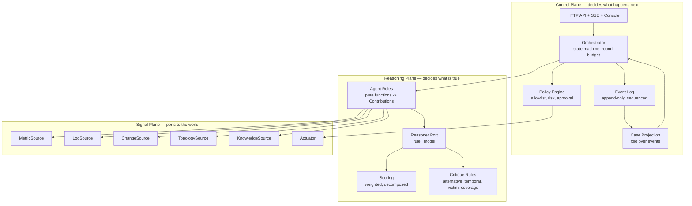
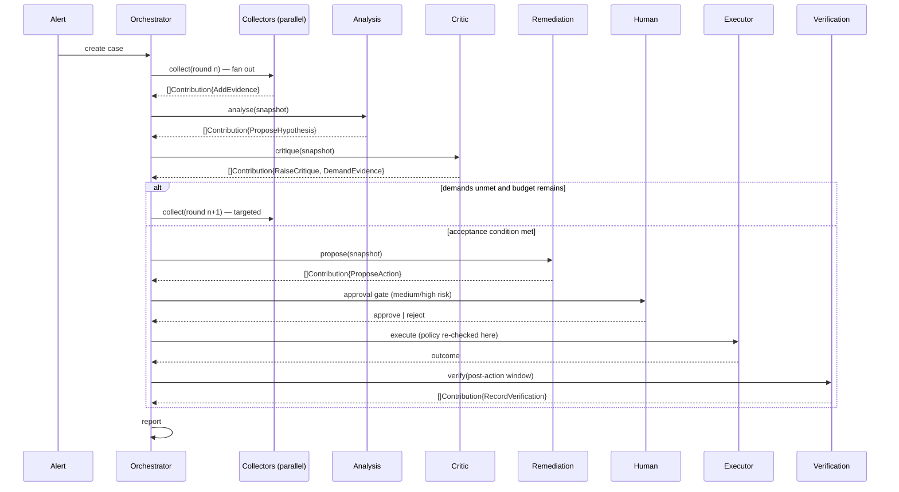

# IncidentOps Arena — Architecture

## 1. Architectural drivers

Six forces shape this structure. Everything else is detail.

| # | Driver | Source | Why it shapes structure |
|---|---|---|---|
| D1 | The critic must be able to *change the outcome*, not annotate it | G-002, REQ-0031 | Objection and evidence-demand must be first-class state transitions, so control flow — not prompt wording — carries the adversarial mechanism |
| D2 | Every conclusion must resolve to raw evidence | G-001, REQ-0002 | Evidence is an immutable entity with an identity and a query reference, never a paragraph inside a model's answer |
| D3 | Identical input must produce identical output, offline | G-006, REQ-0090 | Reasoning must sit behind a port whose default adapter is deterministic; every external signal needs a fixture adapter |
| D4 | Write actions must be stoppable by a human at a chokepoint | G-003, REQ-0043 | Policy evaluation must be a runtime gate immediately before execution, not advice consulted during planning |
| D5 | The whole investigation must replay | G-004, REQ-0003 | State is a projection of an append-only log; there is no second source of truth |
| D6 | Collection is parallel, judgement is serial | REQ-0061 | Agents cannot mutate shared state, so their output must be a value the orchestrator applies in a deterministic order |

The single most consequential consequence of D1 and D6 together is that **agents
cannot be procedures that "do things"**. They must be functions that *return proposed
changes*. Everything below follows from that.

## 2. Quality attribute scenarios

| # | Stimulus | Environment | Response | Measure |
|---|---|---|---|---|
| Q1 | Alert arrives for a service whose logs are dominated by a non-causal error | Fixture profile, 3-round budget | The critic raises the alternative explanation and demands discriminating evidence; ranking changes after round 2 | Post-critique top-1 differs from pre-critique top-1 |
| Q2 | Same case executed twice in separate processes | Fixture profile, no network | Reports are identical | Byte equality of report and of every generated identifier |
| Q3 | An approved medium-risk action's arguments are tampered with before execution | Policy engine active | Execution refused, refusal recorded as an event | Zero actuator invocations; one `action_refused` event |
| Q4 | A console client disconnects mid-investigation | Live event stream | Case completes unaffected; a reconnecting client resumes from its last sequence with no gap | Received sequence numbers contiguous across reconnect |
| Q5 | Critic demands evidence on every round | 3-round budget | Investigation terminates after exactly 3 collection rounds with unmet demands recorded | Round count == 3; report lists unmet demands |
| Q6 | A log line contains text instructing a restart | Any profile | No action originates from that text; policy unchanged | Zero actions whose provenance is log content |

## 3. Structure

### 3.1 Plane view

The system separates into three planes with a strict dependency direction: the Control
Plane depends on the Reasoning Plane, which depends on the Signal Plane's *ports* —
never on their adapters.

Note what the diagram forbids. Agents do not reach the event log; only the orchestrator
writes. Agents do not reach the actuator; only the policy engine, after approval. The
reasoning plane never learns which adapter is behind a port.

### 3.2 Runtime view

## 4. Architecture items

<!-- sdd:item id=ARC-001 stage=architect status=approved derives_from=REQ-0001,REQ-0010,REQ-0060 -->
### ARC-001 — Three planes with a one-way dependency rule

**Element.** Signal Plane (ports to external systems), Reasoning Plane (what is true),
Control Plane (what happens next).

**Responsibility.** Confine each kind of change to one plane: a new data source touches
only the Signal Plane; a new inference rule only the Reasoning Plane; a new flow rule
only the Control Plane.

**Constraints.** The Reasoning Plane MUST NOT import an adapter, a store or the event
log. The Signal Plane MUST NOT import the Reasoning or Control Plane. Enforced by
package dependency direction and asserted by a test.

**Realises.** REQ-0001, REQ-0010, REQ-0060

<!-- sdd:item id=ARC-002 stage=architect status=approved derives_from=REQ-0001,REQ-0005 -->
### ARC-002 — The Contribution algebra is the only currency

**Element.** A closed sum type: `AddEvidence`, `ProposeHypothesis`, `RaiseCritique`,
`DemandEvidence`, `ProposeAction`, `RecordVerification`, `RecordExecution`.

**Responsibility.** Be the sole channel through which anything an agent concludes can
affect the case.

**Constraints.** Agents return `[]Contribution` and nothing else — no error side
effects, no writes, no I/O beyond their declared ports. Each role declares the subset it
may emit; the orchestrator rejects out-of-role contributions and records the violation.
Adding a seventh contribution kind is an architectural change requiring an amendment,
not an incremental feature.

**Why this and not "agents that act".** Three properties fall out for free: agents
become table-testable pure functions; parallel collection is safe without locks; and
the event log writes itself, because every applied contribution is exactly one event.
An agent that mutated state directly would forfeit all three, and D5 would become a
bookkeeping discipline that decays.

**Realises.** REQ-0001, REQ-0005

<!-- sdd:item id=ARC-003 stage=architect status=approved derives_from=REQ-0003,REQ-0052,REQ-0053,REQ-0062 -->
### ARC-003 — Case state is a fold over an append-only log

**Element.** `Event` records with contiguous sequence numbers, and a `Case` projection
computed by folding them.

**Responsibility.** Guarantee that the live view and the replayed view cannot diverge,
because they are produced by the same function.

**Constraints.** No component writes a projection field directly. Replay from empty MUST
yield an equal projection. Events are never mutated or deleted.

**Realises.** REQ-0003, REQ-0052, REQ-0053, REQ-0062

<!-- sdd:item id=ARC-004 stage=architect status=approved derives_from=REQ-0001,REQ-0004,REQ-0061,REQ-0080,REQ-0081 -->
### ARC-004 — Agents are pure; the orchestrator is the single writer

**Element.** `Agent.Run(ctx, Snapshot) ([]Contribution, error)` plus an orchestrator
apply step that assigns identifiers and appends events.

**Responsibility.** Make concurrency safe and ordering deterministic.

**Constraints.** Identifiers are assigned by the orchestrator from `(caseID, role,
sequence)` — never inside an agent, never from a clock or a random source. Collector
contributions are sorted by `(role order, agent-local index)` before application, so
completion order cannot influence the result.

**Realises.** REQ-0001, REQ-0004, REQ-0061, REQ-0080, REQ-0081

<!-- sdd:item id=ARC-005 stage=architect status=approved derives_from=REQ-0011,REQ-0020,REQ-0090,REQ-0100 -->
### ARC-005 — The Reasoner port separates what to think from how to think

**Element.** A port whose default adapter is a deterministic rule engine over a fault
signature catalog, and whose alternative adapter is model-backed.

**Responsibility.** Let the flow, the contracts and the tests be written once and hold
for either reasoning strategy.

**Constraints.** The default adapter MUST NOT perform I/O. Swapping adapters MUST NOT
change any contract, any state transition or any stored schema. A model adapter's output
is untrusted structured data: it passes the same validation as any other contribution.

**Why the deterministic adapter is the default and not a stub.** A test suite cannot
assert on a sampled distribution, and a demo cannot depend on an endpoint. The rule
engine is a real inference mechanism — a signature catalog with mechanism narratives —
so the offline system is a working product, not a placeholder.

**Realises.** REQ-0011, REQ-0020, REQ-0090, REQ-0100

<!-- sdd:item id=ARC-006 stage=architect status=approved derives_from=REQ-0010,REQ-0012,REQ-0013,REQ-0014,REQ-0015,REQ-0016,REQ-0082,REQ-0096,REQ-0097,REQ-0098 -->
### ARC-006 — Signal ports are fixture-first

**Element.** Six ports — metric, log, change, topology, knowledge, actuator — each with
a fixture adapter and a live adapter, chosen by a named profile.

**Responsibility.** Make the offline path the primary path, not a degraded one.

**Constraints.** Every port applies its result bound before returning, and marks
truncation. Fixture data is declarative case data (ARC-006 with REQ-0082), so a new
fault scenario is a data file, not a code change. The live adapter for the actuator may
target only the demo stack.

**Realises.** REQ-0010, REQ-0012, REQ-0013, REQ-0014, REQ-0015, REQ-0016, REQ-0082,
REQ-0096, REQ-0097, REQ-0098

<!-- sdd:item id=ARC-007 stage=architect status=approved derives_from=REQ-0021,REQ-0035 -->
### ARC-007 — Evidence coverage is a lattice, and progression is guarded by it

**Element.** `EvidenceKind` as a small closed set, and a coverage set per hypothesis
over which progression predicates are expressed.

**Responsibility.** Turn "evidence before conclusion" from a principle into a computed
precondition.

**Constraints.** The guard is evaluated by the orchestrator, not by the agent proposing
the hypothesis — the party that wants to advance is not the party that decides whether
it may. Coverage requirements are configuration, so tightening them does not touch
agent code.

**Realises.** REQ-0021, REQ-0035

<!-- sdd:item id=ARC-008 stage=architect status=approved derives_from=REQ-0022,REQ-0023,REQ-0024 -->
### ARC-008 — Scoring is a pure function with a stored breakdown

**Element.** `Score(hypothesis, evidence) ScoreBreakdown` returning per-term
contributions, the penalty and the total.

**Responsibility.** Make a ranking arguable. A number a reviewer cannot decompose is a
number a reviewer cannot challenge.

**Constraints.** Weights are declared configuration summing to 1.0, asserted by a test.
The breakdown is stored with the hypothesis and rendered in the console and the report.
Ranking is a total order with declared tiebreakers, so equal inputs rank equally on
every run and in every process.

**Realises.** REQ-0022, REQ-0023, REQ-0024

<!-- sdd:item id=ARC-009 stage=architect status=approved derives_from=REQ-0030,REQ-0031,REQ-0032,REQ-0033,REQ-0034,REQ-0036,REQ-0099 -->
### ARC-009 — Adversarial review is a rule ensemble with demand and veto powers

**Element.** Independent critique rules — alternative explanation, temporal order,
source-versus-victim, coverage gap, unverifiable remediation, close-call margin — each
producing critiques and optional evidence demands, combined into a verdict.

**Responsibility.** Give the critic structural authority: `DemandEvidence` re-enters
collection, and a non-accepting verdict blocks remediation.

**Constraints.** The critic MUST NOT emit `ProposeHypothesis`; its power is to
challenge, demand and veto, never to substitute its own answer. Rules are independent
and individually testable; adding a rule cannot silently weaken another. Demands
carry structured descriptors, so the next collection round can be *targeted* rather
than a blind repeat.

**Why an ensemble rather than one critic prompt.** A single critique step produces one
objection and stops. Independent rules each fire on their own trigger, so a case can
be challenged on timing *and* on an alternative explanation simultaneously — and each
rule's absence is detectable by a test.

**Realises.** REQ-0030, REQ-0031, REQ-0032, REQ-0033, REQ-0034, REQ-0036, REQ-0099

<!-- sdd:item id=ARC-010 stage=architect status=approved derives_from=REQ-0040,REQ-0041,REQ-0042,REQ-0043,REQ-0044,REQ-0045,REQ-0046 -->
### ARC-010 — The policy engine is a pre-execution chokepoint

**Element.** A single evaluation function invoked at two moments: when an action is
proposed (to classify and gate) and immediately before execution (to authorise).

**Responsibility.** Ensure no execution path exists that does not pass policy.

**Constraints.** The executor holds the only reference to the actuator port and calls
policy before every invocation; there is no bypass parameter and no privileged mode.
Denials are unconditional for shell, SQL, deletion and cross-service bulk operations —
these are refused as *categories*, before any allowlist is consulted. Retrieved content
can never reach policy input; the executor accepts typed actions only.

**Realises.** REQ-0040, REQ-0041, REQ-0042, REQ-0043, REQ-0044, REQ-0045, REQ-0046

<!-- sdd:item id=ARC-011 stage=architect status=approved derives_from=REQ-0031,REQ-0050,REQ-0051,REQ-0060,REQ-0094 -->
### ARC-011 — Bounded budgets are the termination guarantee

**Element.** A round budget, per-round hypothesis and critique caps, and an evidence
retention cap.

**Responsibility.** Guarantee termination and bounded memory even when the critic never
accepts and verification never succeeds.

**Constraints.** Every loop edge in the state machine decrements a budget. Exhaustion
never silently drops information: unmet demands, truncated evidence and unverified
recoveries are recorded and surface in the report.

**Realises.** REQ-0031, REQ-0050, REQ-0051, REQ-0060, REQ-0094

<!-- sdd:item id=ARC-012 stage=architect status=approved derives_from=REQ-0064 -->
### ARC-012 — Event fan-out is buffered per subscriber with a resumable cursor

**Element.** A broker holding per-subscriber bounded channels, plus replay from a
sequence number against the stored log.

**Responsibility.** Let the console watch live without ever becoming able to stall an
investigation.

**Constraints.** A subscriber whose buffer fills is dropped, never blocked; a dropped
subscriber reconnects and replays from its last sequence, so no event is lost from the
client's perspective. The orchestrator never awaits a subscriber.

**Realises.** REQ-0064

<!-- sdd:item id=ARC-013 stage=architect status=approved derives_from=REQ-0002,REQ-0003 -->
### ARC-013 — Storage is a port with in-memory and durable adapters

**Element.** A `Store` port over cases and events; a memory adapter for tests and a
file-backed append-only adapter for deployment.

**Responsibility.** Keep durability a deployment decision rather than a design
commitment.

**Constraints.** The port exposes append and range-read over events and a case index;
it does not expose queries a relational engine would be needed for. Should scale demand
it, a database adapter implements the same port without touching any plane above.

**Realises.** REQ-0002, REQ-0003

<!-- sdd:item id=ARC-014 stage=architect status=approved derives_from=REQ-0063,REQ-0065,REQ-0091,REQ-0092,REQ-0093,REQ-0095 -->
### ARC-014 — One binary, embedded console, embedded fixtures

**Element.** A single executable serving the API, the event stream and the
server-rendered console, with fixture data and console assets embedded.

**Responsibility.** Make the artifact trivially deployable and the demo impossible to
misconfigure.

**Constraints.** No build-time network access, no second runtime, no external asset
path. The container image adds only a non-root user, a health check and the binary.

**Why this makes release cheap.** Because the artifact is one static binary with nothing
beside it, publishing a version is a build and a push rather than an assembly step: there
is no dependency set to resolve at build time, no asset bundle to ship alongside the
image, and no configuration file the release must carry to be runnable. That is what
lets the release pipeline be a straight line from tag to registry (REQ-0095).

**Realises.** REQ-0063, REQ-0065, REQ-0091, REQ-0092, REQ-0093, REQ-0095

## 5. Ports and adapters

| Port | Purpose | Default adapter | Alternative adapters |
|---|---|---|---|
| `MetricSource` | Range and instant series queries | `fixture` — declarative series from case data | `prometheus` — HTTP range/query API |
| `LogSource` | Windowed, filtered log retrieval | `fixture` — declarative log lines | `file`, `docker` |
| `ChangeSource` | Deployment and configuration history | `fixture` — declarative change records | `file` deploy history, `git` log |
| `TopologySource` | Service dependency graph | `fixture` — declarative catalog | `file` service catalog |
| `KnowledgeSource` | Runbook retrieval | `embedded` — indexed markdown corpus | `file` corpus |
| `Actuator` | Configuration set, restart, scale, ticket | `simulated` — in-process demo state | `compose` — demo stack only |
| `Reasoner` | Hypothesis formation and critique | `rule` — signature catalog, deterministic | `model` — provider behind the same interface |
| `Store` | Case and event persistence | `memory` | `file` append-only log |

## 6. Rejected alternatives

| Alternative | Attraction | Why rejected |
|---|---|---|
| Fork and adapt an existing agentic incident platform | Large head start on product surface | Its dependency set (several databases, a vault, two runtimes) is larger than this system, and the adversarial mechanism, the scoring model and the reproducible fault library — the actual subject of this work — would still be built by hand. D3 in particular is unreachable when the demo needs live connectors |
| An agent graph framework driving LLM nodes | Familiar shape; less orchestration code | The state machine *is* the contribution: bounded rounds, coverage guards, approval gating and replay. Expressing those as framework configuration would hide exactly what needs to be demonstrated, and would make D3 depend on a provider |
| Agents that call tools and write state directly | Fewer moving parts; obvious to read | Loses safe parallelism, deterministic ordering and automatic event derivation at once. The critic's demand power would become a shared flag rather than a state transition |
| A relational schema as the primary model | Natural for reporting and ad-hoc queries | The primary access pattern is "replay this case", which is an append-and-scan. A schema would add a migration surface and a service dependency to buy queries no requirement asks for. ARC-013 keeps the option open |
| A separate single-page console application | Richer interaction | A second toolchain and runtime, for a view whose job is to make a timeline legible. ARC-014 delivers the same visibility with no build step |
| Free-form natural language between agents | Maximum flexibility | Directly contradicts D2 and D6, and makes every downstream assertion untestable |

## 7. Risks

| # | Risk | Impact | Mitigation | Trigger to revisit |
|---|---|---|---|---|
| R1 | The rule reasoner is mistaken for the system's ceiling | Reviewers read the deterministic default as "no real reasoning" | The reasoner port is documented and exercised by a second adapter contract test; the manual states the substitution explicitly | A model adapter is wired |
| R2 | The signature catalog overfits the demo scenarios | Apparent accuracy that does not generalise | Evaluation reports sample size beside every number; the misleading-log case (M5) exists to expose overfitting | Top-1 accuracy stays flat when a new case is added |
| R3 | The critic's rules make it obstructive rather than useful | Every case ends in human review | Close-call margin and round budget are configuration; the evaluation measures corrections made, not objections raised | Human-review rate exceeds a third of cases |
| R4 | The file store's append-only log grows without bound | Disk exhaustion in long-running deployments | Per-case retention caps (ARC-011); the store port allows a compacting adapter | A deployment runs beyond the demo lifetime |
| R5 | Fixture and live adapters drift apart in behaviour | Offline tests pass, live path fails | A shared adapter contract test suite runs against both; live adapters are exercised in M4 | Any live-only defect is found |
| R6 | Determinism erodes as concurrency is added | Flaky tests, unreproducible demos | Contribution ordering is a property test (Q2) run repeatedly in CI | Any test becomes order-dependent |

## 8. Architecture decision records

Decisions with consequences beyond a single item are recorded separately, one document
pair per decision, under `docs/adr/`:

| ADR | Decision |
|---|---|
| ADR-001 | Go and the standard library as the implementation substrate |
| ADR-002 | A deterministic rule reasoner as the default, with a model adapter behind the port |
| ADR-003 | Event-sourced case projection rather than mutable records |
| ADR-004 | A file-backed append-only store rather than an embedded or external database |
| ADR-005 | A server-rendered embedded console rather than a separate front-end application |
| ADR-006 | A declarative fault signature and case catalog rather than hard-coded scenarios |
