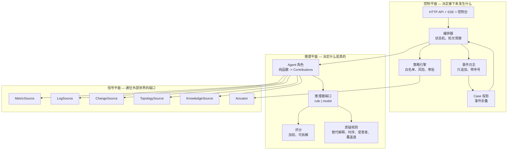
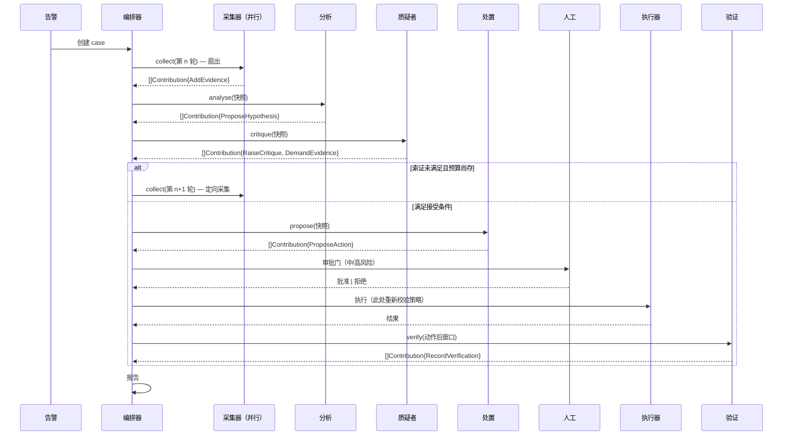

# IncidentOps Arena — 架构设计

## 1. 架构驱动因素

有六股力量塑造了这个结构，其余都是细节。

| # | 驱动因素 | 来源 | 为何影响结构 |
|---|---|---|---|
| D1 | 质疑者必须能**改变结果**，而不是给结果加批注 | G-002, REQ-0031 | 反对与索证必须是一等的状态迁移，从而让对抗机制由控制流承载，而不是由提示词措辞承载 |
| D2 | 每个结论都必须能回溯到原始证据 | G-001, REQ-0002 | 证据是带身份与查询引用的不可变实体，而绝非模型回答里的一段话 |
| D3 | 相同输入必须离线产生相同输出 | G-006, REQ-0090 | 推理必须位于端口之后，且其默认适配器是确定性的；每个外部信号都需要夹具适配器 |
| D4 | 写入动作必须能在某个咽喉点被人拦下 | G-003, REQ-0043 | 策略评估必须是执行前一刻的运行时门禁，而不是规划阶段查阅的建议 |
| D5 | 整个调查过程必须可重放 | G-004, REQ-0003 | 状态是只追加日志的投影；不存在第二个真相来源 |
| D6 | 采集并行，判断串行 | REQ-0061 | Agent 不能修改共享状态，因此其输出必须是编排器按确定顺序应用的值 |

D1 与 D6 合在一起最具决定性的后果是：**Agent 不能是"去做事"的过程**。它们必须是*返回
拟议变更*的函数。下面的一切都由此推出。

## 2. 质量属性场景

| # | 触发 | 环境 | 响应 | 度量 |
|---|---|---|---|---|
| Q1 | 某服务告警，其日志被非因果错误刷屏 | 夹具档，3 轮预算 | 质疑者提出替代解释并索取区分性证据；第 2 轮后排序改变 | 质疑后 top-1 与质疑前 top-1 不同 |
| Q2 | 同一 case 在两个独立进程中各执行一次 | 夹具档，无网络 | 两份报告完全一致 | 报告与每个生成标识符逐字节相等 |
| Q3 | 已审批的中风险动作在执行前被篡改参数 | 策略引擎启用 | 执行被拒绝，拒绝以事件记录 | 执行器调用次数为 0；一条 `action_refused` 事件 |
| Q4 | 控制台客户端在调查中途断开 | 实时事件流 | Case 不受影响地完成；重连客户端从上次序号无缝续传 | 重连前后收到的序号连续 |
| Q5 | 质疑者每轮都索取证据 | 3 轮预算 | 调查恰好在 3 轮采集后终止，并记录未满足的索证 | 轮次数 == 3；报告列出未满足索证 |
| Q6 | 某行日志包含"执行重启"的指示文本 | 任意档 | 不会从该文本产生任何动作；策略不变 | 来源为日志内容的动作数为 0 |

## 3. 结构

### 3.1 平面视图

系统划分为三个平面，依赖方向严格单向：控制平面依赖推理平面，推理平面依赖信号平面的
*端口*——而永远不依赖其适配器。

注意这张图禁止了什么。Agent 触碰不到事件日志；只有编排器写入。Agent 触碰不到执行器；
只有策略引擎在审批之后才可以。推理平面永远不知道端口背后是哪个适配器。

### 3.2 运行时视图

## 4. 架构条目

<!-- sdd:item id=ARC-001 stage=architect status=approved derives_from=REQ-0001,REQ-0010,REQ-0060 -->
### ARC-001 — 三个平面与单向依赖规则

**元素。** 信号平面（通往外部系统的端口）、推理平面（什么是真的）、控制平面（接下来
发生什么）。

**职责。** 把每一类变更约束在一个平面内：新增数据源只触碰信号平面；新增推断规则只触碰
推理平面；新增流程规则只触碰控制平面。

**约束。** 推理平面不得 import 任何适配器、存储或事件日志。信号平面不得 import 推理平面
或控制平面。由包依赖方向强制，并由测试断言。

**实现需求。** REQ-0001, REQ-0010, REQ-0060

<!-- sdd:item id=ARC-002 stage=architect status=approved derives_from=REQ-0001,REQ-0005 -->
### ARC-002 — Contribution 代数是唯一货币

**元素。** 一个封闭的和类型：`AddEvidence`、`ProposeHypothesis`、`RaiseCritique`、
`DemandEvidence`、`ProposeAction`、`RecordVerification`、`RecordExecution`。

**职责。** 成为"Agent 得出的任何结论能够影响 case"的唯一通道。

**约束。** Agent 只返回 `[]Contribution`，别无其他——没有错误副作用、没有写入、除声明
端口外没有任何 I/O。每个角色声明它可以发出的子集；编排器拒绝越权贡献并记录违规。新增
第七种 contribution 是需要修订的架构变更，而不是一次增量特性。

**为什么是这样，而不是"会做事的 Agent"。** 三个性质由此免费得到：Agent 成为可表驱动测试
的纯函数；并行采集无需加锁即安全；事件日志自己写自己，因为每个被应用的贡献恰好对应一条
事件。若 Agent 直接修改状态，这三点全部丧失，而 D5 会退化成一种会逐渐腐坏的记账纪律。

**实现需求。** REQ-0001, REQ-0005

<!-- sdd:item id=ARC-003 stage=architect status=approved derives_from=REQ-0003,REQ-0052,REQ-0053,REQ-0062 -->
### ARC-003 — Case 状态是只追加日志的折叠

**元素。** 带连续序号的 `Event` 记录，以及通过折叠它们计算出的 `Case` 投影。

**职责。** 保证实时视图与重放视图不可能分叉——因为二者由同一个函数产生。

**约束。** 没有任何组件直接写投影字段。从空状态重放必须产出相等的投影。事件永不被修改或
删除。

**实现需求。** REQ-0003, REQ-0052, REQ-0053, REQ-0062

<!-- sdd:item id=ARC-004 stage=architect status=approved derives_from=REQ-0001,REQ-0004,REQ-0061,REQ-0080,REQ-0081 -->
### ARC-004 — Agent 是纯的；编排器是唯一写入方

**元素。** `Agent.Run(ctx, Snapshot) ([]Contribution, error)`，以及编排器中负责分配
标识符并追加事件的应用步骤。

**职责。** 让并发安全、让顺序确定。

**约束。** 标识符由编排器依据 `(caseID, role, sequence)` 分配——绝不在 Agent 内部分配，
绝不来自时钟或随机源。采集器的贡献在应用前按 `(角色序, Agent 内序号)` 排序，因此完成
顺序无法影响结果。

**实现需求。** REQ-0001, REQ-0004, REQ-0061, REQ-0080, REQ-0081

<!-- sdd:item id=ARC-005 stage=architect status=approved derives_from=REQ-0011,REQ-0020,REQ-0090,REQ-0100,REQ-0104,REQ-0105,REQ-0106 -->
### ARC-005 — 推理器端口把"想什么"和"怎么想"分开

**元素。** 一个端口，其默认适配器是基于故障签名目录的确定性规则引擎，其备选适配器由模型
支撑。

**职责。** 让流程、契约与测试写一次，并对两种推理策略都成立。

**约束。** 默认适配器不得执行 I/O。更换适配器不得改变任何契约、任何状态迁移或任何存储
模式。模型适配器的输出是不可信的结构化数据：它与任何其他贡献一样要通过同样的校验。

**为什么确定性适配器是默认而非桩件。** 测试套件无法对一个采样分布做断言，演示也不能依赖
某个端点。规则引擎是真实的推断机制——一个带机理叙述的签名目录——因此离线系统是一个可用
产品，而不是占位符。

**只有两侧都能被实际运行，端口才配叫端口。** 上面那个声称——换适配器不改变任何契约、任何
状态迁移、任何存储结构——是一个**经验性**声称，架构必须让它可被核对，而不是只被陈述。有两
个结构承载这一点：选择方式必须能从**每一个**产出可比较结果的入口抵达；两个适配器都要对同一
份**行为**契约测试负责，而不只是满足同一个 Go 接口（REQ-0104、REQ-0105）。两侧都能编译通过
的接口只是形状；编排器依赖的是行为。

结果由哪个适配器产出，要随结果一起流转（REQ-0106）。一份不说明各行由什么产出的对照，不是
对照。

本元素是 ARC-019 所推广的那一族端口中的**第一个**：每一个判断都按这些条款获得一个策略端口，
而每一个这样的端口都欠着同一份契约测试。这里**特有**的是推理器；**通用**的是这个形状。

**实现需求。** REQ-0011, REQ-0020, REQ-0090, REQ-0100, REQ-0104, REQ-0105, REQ-0106

<!-- sdd:item id=ARC-019 stage=architect status=approved derives_from=REQ-0107,REQ-0108 -->
### ARC-019 — 策略端口覆盖判断，不覆盖测量

**元素。** 一族端口——triage、采集规划，以及 ARC-005 的推理器——每一个都以确定性适配器为默认，
并有一个由同一套配置选择的模型支撑备选。

**职责。** 把调查过程中做出的每一个**判断**放到可替换的策略之后；把每一次**测量**与每一个
**类型化动作**留在算术与目录能够被追责的地方。

**约束。** 在每个端口上，模型适配器的输出都是不可信的结构化数据：规划中出现的、数据源并不
提供的序列会被丢弃；一个什么也没返回的规划器会回退到确定性方案——一个失败的策略不得让调查
失明。remediation 与 verification 不获得端口（REQ-0108）：策略引擎只能对它能解析的东西设门；
而一个"策略可以与之不一致"的恢复判定，就不再是证据。

**为什么这条线画在"判断"上而不是画在"角色数量"上。** 目标文档为每个角色指定一个提示词——那
是在数组件。真正要紧的是一个组件**决定**了什么。collection 是最尖锐的例子：今天它什么也没
决定——每个采集器都向数据源索要它提供的一切——于是那个决定了首轮错误、因而也决定了质疑者必须
推翻什么（REQ-0103）的选择，属于夹具而不属于任何 Agent。这才是值得弥合的差距；而按数量去
弥合，只会把自然语言放到执行器前面，同时把真正的差距原封不动地留在那里。

**实现需求。** REQ-0107, REQ-0108

<!-- sdd:item id=ARC-006 stage=architect status=approved derives_from=REQ-0010,REQ-0012,REQ-0013,REQ-0014,REQ-0015,REQ-0016,REQ-0082,REQ-0096,REQ-0097,REQ-0098 -->
### ARC-006 — 信号端口以夹具优先

**元素。** 六个端口——指标、日志、变更、拓扑、知识、执行器——每个都有夹具适配器与在线
适配器，由具名配置档选择。

**职责。** 让离线路径成为主路径，而不是降级路径。

**约束。** 每个端口在返回前施加结果上限，并标记截断。夹具数据是声明式样例数据（ARC-006
配合 REQ-0082），因此新增故障场景是一个数据文件，而不是一次代码变更。执行器的在线适配器
只能指向演示栈。

**实现需求。** REQ-0010, REQ-0012, REQ-0013, REQ-0014, REQ-0015, REQ-0016, REQ-0082,
REQ-0096, REQ-0097, REQ-0098

<!-- sdd:item id=ARC-007 stage=architect status=approved derives_from=REQ-0021,REQ-0035 -->
### ARC-007 — 证据覆盖是一个格，推进由它守卫

**元素。** 作为小型封闭集合的 `EvidenceKind`，以及每个假设之上的覆盖集合，推进谓词就
表达在它之上。

**职责。** 把"证据先于结论"从一条原则变成一个可计算的前置条件。

**约束。** 该守卫由编排器求值，而不是由提出假设的 Agent 求值——想要推进的一方，不是决定
是否可以推进的一方。覆盖要求属于配置，因此收紧它无需触碰 Agent 代码。

**实现需求。** REQ-0021, REQ-0035

<!-- sdd:item id=ARC-008 stage=architect status=approved derives_from=REQ-0022,REQ-0023,REQ-0024 -->
### ARC-008 — 评分是带存储拆解的纯函数

**元素。** `Score(hypothesis, evidence) ScoreBreakdown`，返回逐项贡献、惩罚与总分。

**职责。** 让排序可被争论。一个评审者拆不开的数字，就是一个评审者无法挑战的数字。

**约束。** 权重是声明式配置，总和为 1.0，由测试断言。拆解随假设一起存储，并在控制台与
报告中呈现。排序是带声明式决胜规则的全序，因此相同输入在每次运行、每个进程中排序相同。

**排序与设门是两个不同的问题，因此用两个不同的数。** 平铺的加权和回答的是"这个解释声明了多少、
又证明了多少"，作为**排序**是对的；作为**门**却是错的：它会为签名从未声明过的证据类别记账，
于是一条只声明一类证据的解释被压在任何有用阈值之下，可以排第一却永久不可执行。因此拆解还要
携带"实际押上的权重"以及在其上归一化后的分数；接受阈值读后者，而"它是否声明得够多"则由
ARC-007 守卫中的证据类别条件与变更证据条件单独承担。

**实现需求。** REQ-0022, REQ-0023, REQ-0024

<!-- sdd:item id=ARC-009 stage=architect status=approved derives_from=REQ-0030,REQ-0031,REQ-0032,REQ-0033,REQ-0034,REQ-0036,REQ-0099,REQ-0101,REQ-0102,REQ-0103 -->
### ARC-009 — 对抗评审是带索证权与否决权的规则集合

**元素。** 相互独立的质疑规则——替代解释、时序先后、根因与受害者、覆盖缺口、处置不可
验证、分差过小——每条都产出质疑与可选的索证，并合并为裁决。

**职责。** 赋予质疑者结构性权力：`DemandEvidence` 会重新进入采集，非接受裁决会阻断处置。

**约束。** 质疑者不得发出 `ProposeHypothesis`；它的权力是挑战、索证与否决，绝不是拿出
自己的答案。规则相互独立、可单独测试；新增一条规则不会静默削弱另一条。索证携带结构化
描述符，因此下一轮采集是*定向的*，而不是盲目重跑。

**为什么是规则集合而不是一个质疑提示词。** 单一质疑步骤只会产出一条反对意见然后停下。
独立规则各自按自己的触发条件生效，因此一个 case 可以同时在时序**和**替代解释两个维度上
被挑战——而且每条规则的缺失都可以被测试检出。

**这套集合必须强到什么程度。** 标准不是"找出没人采集的那条要求"（REQ-0103）。一套只会检出
覆盖缺口的规则集合，能通过"首轮答案不完整"的场景，却对"首轮答案完整而错误"的场景无话可说。
因此索证权与否决权并不可以互相替代：覆盖缺口靠**采集**来回答，而一个证据齐备的错误答案，只能
被"记录在案、针对它"的证据挤下来。两条路径都必须存在，并且索证必须能带回**反对**某个假设的
证据，而不只是支持某个假设的证据。

这两种权力都不得无限行使。一条不断索要"没有来源能提供之物"的规则，会把领先假设在余下的整个
case 里按在非接受裁决上；于是这套集合不再是在让答案更锋利，而是在阻止答案出现（REQ-0031）。
因此每条规则只判断一次——依据证据判断——自己是否还有可问的东西。

另外，只有当各个样例以**不同方式**推翻其首轮答案时，这套集合才算被证明（REQ-0103）。若目录
中每个错误的领先者都倒在同一种检查之下，那评估衡量的不过是一条规则披着六个名字。

**实现需求。** REQ-0030, REQ-0031, REQ-0032, REQ-0033, REQ-0034, REQ-0036, REQ-0099, REQ-0101, REQ-0102, REQ-0103

<!-- sdd:item id=ARC-010 stage=architect status=approved derives_from=REQ-0040,REQ-0041,REQ-0042,REQ-0043,REQ-0044,REQ-0045,REQ-0046 -->
### ARC-010 — 策略引擎是执行前的咽喉点

**元素。** 一个评估函数，在两个时刻被调用：动作被提议时（用于分级与设门）、以及执行前
一刻（用于授权）。

**职责。** 保证不存在任何绕过策略的执行路径。

**约束。** 执行器持有指向执行器端口的唯一引用，并在每次调用前调用策略；不存在绕过参数，
也不存在特权模式。对 shell、SQL、删除与跨服务批量操作的拒绝是无条件的——它们作为*类别*
被拒绝，在查阅任何白名单之前。检索到的内容永远无法进入策略输入；执行器只接受带类型的动作。

**实现需求。** REQ-0040, REQ-0041, REQ-0042, REQ-0043, REQ-0044, REQ-0045, REQ-0046

<!-- sdd:item id=ARC-011 stage=architect status=approved derives_from=REQ-0031,REQ-0050,REQ-0051,REQ-0060,REQ-0094 -->
### ARC-011 — 有界预算是终止性保证

**元素。** 轮次预算、每轮假设与质疑上限，以及证据保留上限。

**职责。** 即便质疑者永不接受、验证永不成功，也保证终止且内存有界。

**约束。** 状态机中每条回环边都会消耗一份预算。预算耗尽绝不静默丢失信息：未满足的索证、
被截断的证据与未验证的恢复都会被记录，并出现在报告中。

**预算只能约束"有进展的"循环。** 返回采集阶段的正当理由，是存在一条**尚未被尝试过**的索证；
一条某轮已经试过、却无法回答的索证不构成进展，把剩余预算花在重问它上面，会把这项保证变成
倒计时。预算约束的是"案件可以尝试多少次新东西"，而不是"它可以重复自己多少次"（REQ-0031）。

**实现需求。** REQ-0031, REQ-0050, REQ-0051, REQ-0060, REQ-0094

<!-- sdd:item id=ARC-012 stage=architect status=approved derives_from=REQ-0064 -->
### ARC-012 — 事件扇出按订阅者缓冲，游标可续传

**元素。** 一个持有按订阅者划分的有界通道的分发器，外加基于存储日志、从某个序号开始的
重放能力。

**职责。** 让控制台可以实时观看，但永远不可能拖住一次调查。

**约束。** 缓冲写满的订阅者会被丢弃，而不是被阻塞；被丢弃的订阅者重连后从上次序号重放，
因此从客户端视角看没有事件丢失。编排器永不等待订阅者。

**实现需求。** REQ-0064

<!-- sdd:item id=ARC-013 stage=architect status=approved derives_from=REQ-0002,REQ-0003 -->
### ARC-013 — 存储是带内存与持久两种适配器的端口

**元素。** 覆盖 case 与事件的 `Store` 端口；用于测试的内存适配器，以及用于部署的文件
只追加适配器。

**职责。** 让持久化成为部署决策，而不是设计承诺。

**约束。** 该端口暴露事件的追加与区间读取以及 case 索引；它不暴露需要关系引擎才能支持的
查询。若规模需要，数据库适配器可以实现同一端口，而不触碰其上任何平面。

**实现需求。** REQ-0002, REQ-0003

<!-- sdd:item id=ARC-014 stage=architect status=approved derives_from=REQ-0063,REQ-0065,REQ-0091,REQ-0092,REQ-0093,REQ-0095 -->
### ARC-014 — 单一二进制，内嵌控制台，内嵌夹具

**元素。** 单个可执行文件，提供 API、事件流与服务端渲染的控制台，夹具数据与控制台资源
均内嵌其中。

**职责。** 让制品部署起来毫不费力，让演示不可能配错。

**约束。** 构建期无需网络访问、无第二个运行时、无外部资源路径。容器镜像只额外添加一个
非 root 用户、一个健康检查与该二进制。

**这为何让发布变得廉价。** 正因为制品就是一个静态二进制、旁边别无他物，发布一个版本才
只是"构建 + 推送"，而不是一次组装：构建期没有依赖集合需要解析，没有资源包需要随镜像一起
分发，也没有配置文件是 release 必须携带才能跑起来的。这正是发布流水线能够从标签到镜像
仓库一条直线走通的原因（REQ-0095）。

**实现需求。** REQ-0063, REQ-0065, REQ-0091, REQ-0092, REQ-0093, REQ-0095

## 5. 端口与适配器

| 端口 | 用途 | 默认适配器 | 备选适配器 |
|---|---|---|---|
| `MetricSource` | 区间与瞬时序列查询 | `fixture` — 来自样例数据的声明式序列 | `prometheus` — HTTP range/query API |
| `LogSource` | 按窗口与过滤条件取日志 | `fixture` — 声明式日志行 | `file`、`docker` |
| `ChangeSource` | 发布与配置历史 | `fixture` — 声明式变更记录 | `file` 发布历史、`git` log |
| `TopologySource` | 服务依赖图 | `fixture` — 声明式服务目录 | `file` 服务目录 |
| `KnowledgeSource` | Runbook 检索 | `embedded` — 建索引的 markdown 语料 | `file` 语料 |
| `Actuator` | 配置设置、重启、扩缩、开单 | `simulated` — 进程内演示状态 | `compose` — 仅限演示栈 |
| `Reasoner` | 假设形成与质疑 | `rule` — 签名目录，确定性 | `model` — 同一接口背后的模型服务 |
| `Store` | Case 与事件持久化 | `memory` | `file` 只追加日志 |

## 6. 被否决的备选方案

| 备选方案 | 吸引力 | 否决原因 |
|---|---|---|
| Fork 并改造现有的 agentic 故障处理平台 | 在产品表层上有很大起步优势 | 它的依赖集合（多个数据库、一个 vault、两个运行时）比本系统还大，而对抗机制、评分模型与可复现故障库——也就是本工作真正的主题——仍然要手写。尤其当演示需要在线连接器时，D3 根本无法达成 |
| 用 agent 图框架驱动 LLM 节点 | 形态熟悉，编排代码更少 | 状态机**本身就是**贡献所在：有界轮次、覆盖守卫、审批门与重放。把这些表达为框架配置，恰好会遮蔽最需要被展示的东西，还会让 D3 依赖某个服务商 |
| 让 Agent 直接调用工具并写状态 | 组件更少，读起来直观 | 会一次性丧失安全并行、确定顺序与事件自动派生三项性质。质疑者的索证权会退化成一个共享标志位，而不是一次状态迁移 |
| 以关系模式作为主模型 | 天然适合报表与临时查询 | 主要访问模式是"重放这个 case"，本质是追加与扫描。引入模式只会增加迁移面与服务依赖，换来的是没有任何需求提出的查询能力。ARC-013 保留了这个选项 |
| 独立的单页控制台应用 | 交互更丰富 | 为了一个"把时间线呈现清楚"的视图，引入第二套工具链与运行时。ARC-014 无需构建步骤即可提供同等可见性 |
| Agent 之间用自由形式自然语言 | 灵活性最大 | 直接违背 D2 与 D6，并使下游每一条断言都无法测试 |

## 7. 风险

| # | 风险 | 影响 | 缓解措施 | 重新评估的触发条件 |
|---|---|---|---|---|
| R1 | 规则推理器被误认为系统能力上限 | 评审者把确定性默认读成"没有真正的推理" | 推理器端口有文档，并由第二个适配器契约测试实际检验；手册明确说明可替换性 | 模型适配器接入时 |
| R2 | 签名目录对演示场景过拟合 | 表面准确率无法泛化 | 评估在每个数字旁标注样本量；日志误导样例（M5）就是为了暴露过拟合而存在 | 新增样例后 top-1 准确率不再变化 |
| R3 | 质疑者的规则让它变得阻碍而非有用 | 每个 case 都以人工评审收场 | 分差间距与轮次预算是配置项；评估度量的是"做出的纠正"而非"提出的反对" | 人工评审率超过三分之一 |
| R4 | 文件存储的只追加日志无界增长 | 长期部署下磁盘耗尽 | 逐 case 保留上限（ARC-011）；存储端口允许实现压缩适配器 | 部署时长超出演示生命周期 |
| R5 | 夹具适配器与在线适配器行为漂移 | 离线测试通过，在线路径失败 | 共享的适配器契约测试套件对两者都跑；在线适配器在 M4 被实际检验 | 发现任何仅在线出现的缺陷 |
| R6 | 并发增加后确定性被侵蚀 | 测试不稳定、演示不可复现 | 贡献排序是一条属性测试（Q2），在 CI 中反复运行 | 任何测试变得依赖顺序 |

## 8. 架构决策记录

影响超出单个条目的决策单独记录，每个决策一对文档，位于 `docs/adr/`：

| ADR | 决策 |
|---|---|
| ADR-001 | 以 Go 与标准库作为实现基座 |
| ADR-002 | 以确定性规则推理器为默认，模型适配器置于端口之后 |
| ADR-003 | 采用事件溯源的 case 投影，而非可变记录 |
| ADR-004 | 采用文件只追加存储，而非内嵌或外部数据库 |
| ADR-005 | 采用服务端渲染的内嵌控制台，而非独立前端应用 |
| ADR-006 | 采用声明式故障签名与样例目录，而非硬编码场景 |
| ADR-007 | 模型只从目录中选取签名，打分保持确定性 |
| ADR-008 | 承载判断的角色获得策略端口，承载测量的角色不获得 |
