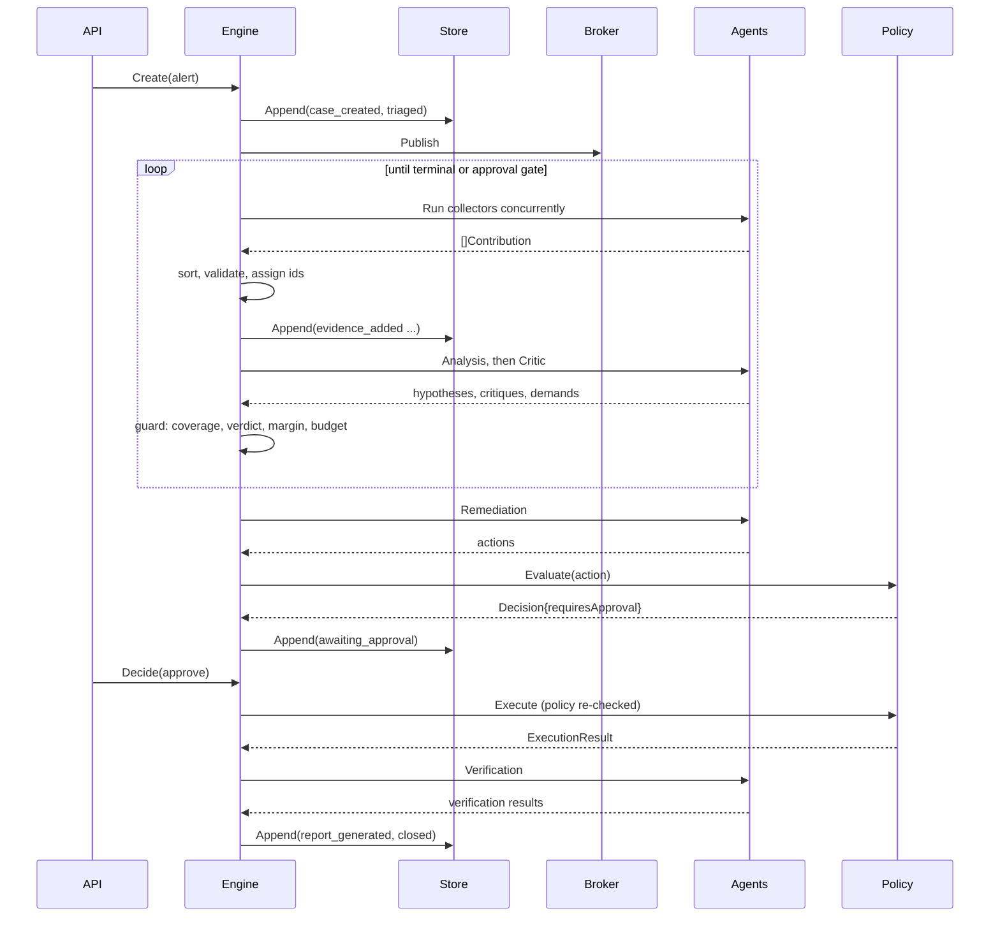

# IncidentOps Arena — High Level Design

## 1. Module map

Dependency direction is strictly downward in this table. A module may import only
modules below it. `domain` imports nothing outside the standard library.

| Module | Go package | Plane | Responsibility | Depends on |
|---|---|---|---|---|
| Entry points | `cmd/arena`, `cmd/evalctl`, `cmd/faultctl` | — | Wire adapters, parse flags, run | all |
| HTTP API | `internal/httpapi` | Control | Routing, validation, SSE, console rendering | orchestrator, store, report, eventbus, domain |
| Evaluation | `internal/eval` | Control | Run cases in three modes, compute metrics | orchestrator, agent, catalog, domain |
| Orchestrator | `internal/orchestrator` | Control | State machine, contribution application, guards, budgets | agent, policy, store, eventbus, domain |
| Event broker | `internal/eventbus` | Control | Per-subscriber fan-out with resumable cursor | domain |
| Policy | `internal/policy` | Control | Risk classification, allowlists, execution authorisation | signal, domain |
| Report | `internal/report` | Control | Markdown and JSON report rendering | domain |
| Store | `internal/store` | Control | Case index, event append and range read | domain |
| Agents | `internal/agent` | Reasoning | Role-bounded functions producing contributions | reasoner, signal, domain |
| Reasoner | `internal/reasoner` | Reasoning | Hypothesis formation, scoring, critique rules | catalog, domain |
| Catalog | `internal/catalog` | Reasoning | Embedded fault signatures and fault cases | domain |
| Signal | `internal/signal` | Signal | Ports, bounds, clustering, anomaly detection | domain |
| Fixture adapters | `internal/signal/fixture` | Signal | Deterministic in-process sources | signal, catalog, domain |
| Live adapters | `internal/signal/live` | Signal | Prometheus, file logs, deploy history | signal, domain |
| Domain | `internal/domain` | — | Entities, contribution algebra, event fold | — |

An architecture test asserts this ordering by inspecting imports, so ARC-001 is
enforced rather than encouraged.

## 2. Module designs

<!-- sdd:item id=HLD-001 stage=hld status=approved derives_from=ARC-002 -->
### HLD-001 — Domain entities and deterministic identifiers

**Purpose.** Define the entities every plane exchanges, and the identifier scheme that
makes runs reproducible.

**Public surface.**

```go
type EvidenceKind string // metric | log | change | topology | knowledge | verification
type Evidence struct {
    ID         string
    Kind       EvidenceKind
    Agent      Role
    Source     string
    Window     TimeWindow
    Summary    string
    RawRef     string
    Confidence float64
    Truncated  bool
    Facts      map[string]string
}
func NewID(caseID string, role Role, seq int) string
```

**Data owned.** Nothing mutable; entities are values.

**Failure behaviour.** Constructors validate ranges and return an error rather than
clamping silently.

**Refines.** ARC-002

<!-- sdd:item id=HLD-002 stage=hld status=approved derives_from=ARC-002 -->
### HLD-002 — Contribution algebra and role capabilities

**Purpose.** Be the only channel from an agent's conclusion to case state, and encode
which roles may say what.

**Public surface.**

```go
type ContributionKind string
type Contribution struct {
    Kind         ContributionKind
    Evidence     *Evidence
    Hypothesis   *Hypothesis
    Critique     *Critique
    Demand       *EvidenceDemand
    Action       *Action
    Verification *VerificationResult
    Execution    *ExecutionResult
}
func (r Role) MayEmit(k ContributionKind) bool
func (c Contribution) Validate() error
```

**Collaborators.** Produced by `agent`, consumed only by `orchestrator`.

**Failure behaviour.** A contribution whose payload does not match its kind, or whose
kind is outside the emitting role's capability set, is rejected with a typed error that
the orchestrator records as an event.

**Refines.** ARC-002

<!-- sdd:item id=HLD-003 stage=hld status=approved derives_from=ARC-003 -->
### HLD-003 — Event log and case projection

**Purpose.** Make the live view and the replayed view the same computation.

**Public surface.**

```go
type Event struct {
    Seq      int
    CaseID   string
    Actor    Role
    Type     EventType
    Summary  string
    Ref      string
    Duration time.Duration
    At       time.Time
}
func Replay(caseID string, events []Event) (*Case, error)
func (c *Case) Apply(e Event) error
```

**Data owned.** The `Case` projection: status, round, evidence, hypotheses, critiques,
demands, actions, verification.

**Failure behaviour.** An event that cannot be applied to the current projection is a
programming error and is returned as such; the log is never partially applied.

**Refines.** ARC-003

<!-- sdd:item id=HLD-004 stage=hld status=approved derives_from=ARC-013 -->
### HLD-004 — Store port and adapters

**Purpose.** Persist events and index cases without committing to a database.

**Public surface.**

```go
type Store interface {
    CreateCase(ctx context.Context, c CaseHeader) error
    ListCases(ctx context.Context) ([]CaseHeader, error)
    Append(ctx context.Context, caseID string, events []Event) error
    Events(ctx context.Context, caseID string, fromSeq int) ([]Event, error)
}
```

**Failure behaviour.** Append is all-or-nothing per call. The file adapter rebuilds its
index from the directory on start, treating the index as derived.

**Refines.** ARC-013

<!-- sdd:item id=HLD-005 stage=hld status=approved derives_from=ARC-006 -->
### HLD-005 — Signal ports

**Purpose.** Define the six boundaries to the outside world, and the bound every result
passes through.

**Public surface.**

```go
type MetricSource interface { Range(ctx, Query) (Series, error) }
type LogSource interface { Search(ctx, LogQuery) ([]LogLine, error) }
type ChangeSource interface { Changes(ctx, string, TimeWindow) ([]Change, error) }
type TopologySource interface { Neighbourhood(ctx, string) (Topology, error) }
type KnowledgeSource interface { Search(ctx, KnowledgeQuery) ([]Runbook, error) }
type Actuator interface { Invoke(ctx, ActionCall) (ActuationResult, error) }
type Bounds struct { MaxRows, MaxChars int; MaxSpan time.Duration }
```

**Failure behaviour.** A port returning more than its bound truncates and reports
truncation; it never returns an unbounded result.

**Refines.** ARC-006

<!-- sdd:item id=HLD-006 stage=hld status=approved derives_from=ARC-006 -->
### HLD-006 — Fixture adapters and the embedded catalog

**Purpose.** Make the offline path the primary path, driven by declarative data.

**Public surface.**

```go
func LoadCatalog() (*Catalog, error)          // embedded signatures and fault cases
func NewFixtureSet(fc FaultCase) SignalSet    // all six ports from one case definition
```

**Collaborators.** Used by the entry points to build a signal set, and by the
evaluation runner.

**Refines.** ARC-006

<!-- sdd:item id=HLD-007 stage=hld status=approved derives_from=ARC-005 -->
### HLD-007 — Reasoner port and rule adapter

**Purpose.** Separate what agents conclude from how the conclusion is reached.

**Public surface.**

```go
type Reasoner interface {
    Hypothesise(ctx context.Context, s Snapshot) ([]Hypothesis, error)
    Critique(ctx context.Context, s Snapshot) ([]Critique, []EvidenceDemand, error)
}
func NewRuleReasoner(cat *Catalog, cfg Config) Reasoner
```

**Failure behaviour.** The rule adapter performs no I/O and cannot fail on external
conditions; it returns an empty hypothesis list when no signature matches, which the
orchestrator treats as an insufficient-evidence condition rather than an error.

**Refines.** ARC-005

<!-- sdd:item id=HLD-008 stage=hld status=approved derives_from=ARC-008 -->
### HLD-008 — Scoring

**Purpose.** Produce an arguable number.

**Public surface.**

```go
type ScoreTerm struct { Name string; Weight, Value, Contribution float64 }
type ScoreBreakdown struct { Terms []ScoreTerm; Penalty, Total float64 }
func Score(h Hypothesis, ev []Evidence, w Weights) ScoreBreakdown
func Rank(hs []Hypothesis) []Hypothesis
```

**Failure behaviour.** None; a pure function over values. Weight validity is asserted
at load time.

**Refines.** ARC-008

<!-- sdd:item id=HLD-009 stage=hld status=approved derives_from=ARC-009 -->
### HLD-009 — Critique rule ensemble

**Purpose.** Give the critic independently testable, individually attributable powers.

**Public surface.**

```go
type CritiqueRule interface {
    Name() string
    Apply(s Snapshot, h Hypothesis) ([]Critique, []EvidenceDemand)
}
func DefaultRules(cat *Catalog, cfg Config) []CritiqueRule
```

**Collaborators.** Composed by the rule reasoner; each rule is unit-tested against a
fixture that triggers exactly it.

**Refines.** ARC-009

<!-- sdd:item id=HLD-010 stage=hld status=approved derives_from=ARC-004 -->
### HLD-010 — Agent roles

**Purpose.** Bind a role, its ports and its reasoner into a pure function.

**Public surface.**

```go
type Agent interface {
    Role() Role
    Run(ctx context.Context, s Snapshot) ([]Contribution, error)
}
func Collectors(sig SignalSet, cfg Config) []Agent
func Analysis(r Reasoner) Agent
func Critic(r Reasoner) Agent
func Remediation(cat *Catalog, cfg Config) Agent
func Verification(sig SignalSet, cfg Config) Agent
func SingleAgentBaseline(sig SignalSet, r Reasoner, cfg Config) Agent
```

**Failure behaviour.** A port error becomes an error return; the orchestrator records
it as an event and continues the round with the remaining collectors.

**Refines.** ARC-004

<!-- sdd:item id=HLD-011 stage=hld status=approved derives_from=ARC-010 -->
### HLD-011 — Policy engine and executor

**Purpose.** Be the only path to an actuator, and the last check before it.

**Public surface.**

```go
type Decision struct { Allowed bool; RequiresApproval bool; Rule, Reason string }
func (p *Engine) Evaluate(a Action) Decision
func (x *Executor) Execute(ctx context.Context, c *Case, a Action) (ExecutionResult, error)
```

**Data owned.** The executor holds the sole reference to the `Actuator` port.

**Failure behaviour.** `Execute` re-evaluates policy against the action as given and
refuses with a recorded reason if the decision is not allowed, regardless of approval
state.

**Refines.** ARC-010

<!-- sdd:item id=HLD-012 stage=hld status=approved derives_from=ARC-007,ARC-011 -->
### HLD-012 — Orchestrator

**Purpose.** Decide what happens next, and be the single writer.

**Public surface.**

```go
type Engine struct { /* agents, policy, store, bus, config */ }
func (e *Engine) Create(ctx context.Context, alert Alert) (*Case, error)
func (e *Engine) Advance(ctx context.Context, caseID string) (*Case, error)
func (e *Engine) Run(ctx context.Context, caseID string) (*Case, error)
func (e *Engine) Decide(ctx context.Context, caseID, actionID string, d ApprovalDecision) (*Case, error)
```

**Data owned.** Case status, round counters and identifier sequences.

**Failure behaviour.** An illegal transition is refused and recorded; `Run` halts at an
approval gate and returns, rather than blocking.

**Refines.** ARC-007, ARC-011

<!-- sdd:item id=HLD-013 stage=hld status=approved derives_from=ARC-012 -->
### HLD-013 — Event broker

**Purpose.** Let clients watch without being able to stall an investigation.

**Public surface.**

```go
func (b *Broker) Subscribe(caseID string, buffer int) (<-chan Event, func())
func (b *Broker) Publish(events ...Event)
```

**Failure behaviour.** A subscriber whose buffer is full is closed and dropped; publish
never blocks.

**Refines.** ARC-012

<!-- sdd:item id=HLD-014 stage=hld status=approved derives_from=ARC-014 -->
### HLD-014 — HTTP API

**Purpose.** Expose the case lifecycle over HTTP with validated input and stable
output.

**Public surface.** `POST /api/cases`, `GET /api/cases`, `GET /api/cases/{id}`,
`GET /api/cases/{id}/events`, `GET /api/cases/{id}/stream`,
`POST /api/cases/{id}/actions/{actionID}/decision`, `GET /api/cases/{id}/report.md`,
`GET /api/cases/{id}/report.json`, `GET /healthz`.

**Failure behaviour.** Validation errors return `400` with `{"error","field"}`; unknown
identifiers return `404`; every response is deterministically ordered.

**Refines.** ARC-014

<!-- sdd:item id=HLD-015 stage=hld status=approved derives_from=ARC-014 -->
### HLD-015 — Console

**Purpose.** Make the adversarial process visible on one screen.

**Public surface.** `GET /` case list, `GET /cases/{id}` workbench with timeline,
evidence by kind, ranked hypotheses with score breakdowns, critiques with verdicts,
actions with an approval control, and the report.

**Failure behaviour.** Rendering failures return `500` with the case identifier; the
live region degrades to the last server-rendered state if the stream drops.

**Refines.** ARC-014

<!-- sdd:item id=HLD-016 stage=hld status=approved derives_from=ARC-003 -->
### HLD-016 — Report generation

**Purpose.** Produce the document a reviewer reads, from the projection alone.

**Public surface.**

```go
func Markdown(c *Case) string
func JSON(c *Case) ([]byte, error)
```

**Failure behaviour.** Pure functions over the projection; a case missing a section
renders that section as explicitly absent rather than omitting it.

**Refines.** ARC-003

<!-- sdd:item id=HLD-017 stage=hld status=approved derives_from=ARC-005 -->
### HLD-017 — Evaluation runner

**Purpose.** Compute the multi-agent claim instead of asserting it.

**Public surface.**

```go
type Mode string // single | multi_no_critic | multi_with_critic
func RunCase(ctx context.Context, fc FaultCase, m Mode) (CaseOutcome, error)
func Summarise(outcomes []CaseOutcome) Report
```

**Failure behaviour.** A failing case is recorded as a failure row rather than aborting
the run.

**Refines.** ARC-005

<!-- sdd:item id=HLD-018 stage=hld status=approved derives_from=ARC-014 -->
### HLD-018 — Entry points

**Purpose.** Wire adapters from configuration and expose operator commands.

**Public surface.** `arena serve`, `arena demo`, `arena report`, `evalctl run`,
`faultctl inject|restore|status`.

**Failure behaviour.** Configuration errors exit `2` with the offending key named;
runtime errors exit `1`.

**Refines.** ARC-014

<!-- sdd:item id=HLD-019 stage=hld status=approved derives_from=ARC-006 -->
### HLD-019 — Live signal adapters and profile selection

**Purpose.** Serve the metric and log ports from real systems without letting the
reasoning plane, or the test suite, learn that anything changed.

**Public surface.**

```go
package prometheus
func New(endpoint string, opts Options) *Source      // implements signal.MetricSource

package containerlog
func New(host string, opts Options) *Source          // implements signal.LogSource

package profile
func Build(name string, fc FaultCase, cat *Catalog, b Bounds) (signal.Set, error)
```

**Failure behaviour.** A live adapter that cannot reach its backend returns a
`signal.SourceError` naming the port and the endpoint. Collectors record it as a degraded
source and continue; an unreachable metric backend never aborts an investigation, because
a partial investigation is worth more than none.

Absence and zero are kept distinct: a `NaN`, a stale marker or an empty result becomes an
absent sample, never a `0.0` reading.

**Collaborators.** Built only by the entry points (HLD-018). Nothing in the reasoning or
control plane refers to these packages.

**Refines.** ARC-006

## 3. Data model

| Entity | Key fields | Owner module | Lifecycle |
|---|---|---|---|
| `CaseHeader` | id, alert, service, severity, status, createdAt | store | Created once, status projected from events |
| `Event` | seq, caseID, actor, type, summary, ref, duration, at | store | Append-only, never mutated |
| `Evidence` | id, kind, agent, source, window, summary, rawRef, confidence, truncated, facts | domain | Immutable once applied |
| `Hypothesis` | id, claim, mechanism, supporting[], counter[], breakdown, status | domain | Score and status updated by new events, not in place |
| `Critique` | id, hypothesisID, rule, category, challenge, verdict, demands[] | domain | Immutable once applied |
| `EvidenceDemand` | id, descriptor, kind, reason, satisfiedBy | domain | Marked satisfied by a later evidence event |
| `Action` | id, title, tool, args, risk, preconditions, rollback, verification, approval, execution | domain | Approval and execution recorded as events |
| `VerificationResult` | signal, before, after, recovered | domain | Immutable once applied |

## 4. External interface summary

| Interface | Kind | Contract reference |
|---|---|---|
| REST API | HTTP/JSON | HLD-014; errors are `{"error","field"}` |
| Event stream | HTTP/SSE | HLD-013; `Last-Event-ID` resumes from a sequence number |
| Console | HTTP/HTML | HLD-015 |
| Prometheus | HTTP/JSON client | `internal/signal/live`; used only in the live profile |
| Actuator | in-process or compose | HLD-011; reachable only through the executor |

## 5. Primary flow sequence



## 6. Design review checklist

- [x] Every ARC item has at least one refining HLD item
- [x] No module has more than one reason to change
- [x] Every port has an offline adapter
- [x] Failure behaviour is specified for every external call
- [x] The dependency table is acyclic and asserted by a test
- [x] Only the orchestrator writes; only the executor actuates
