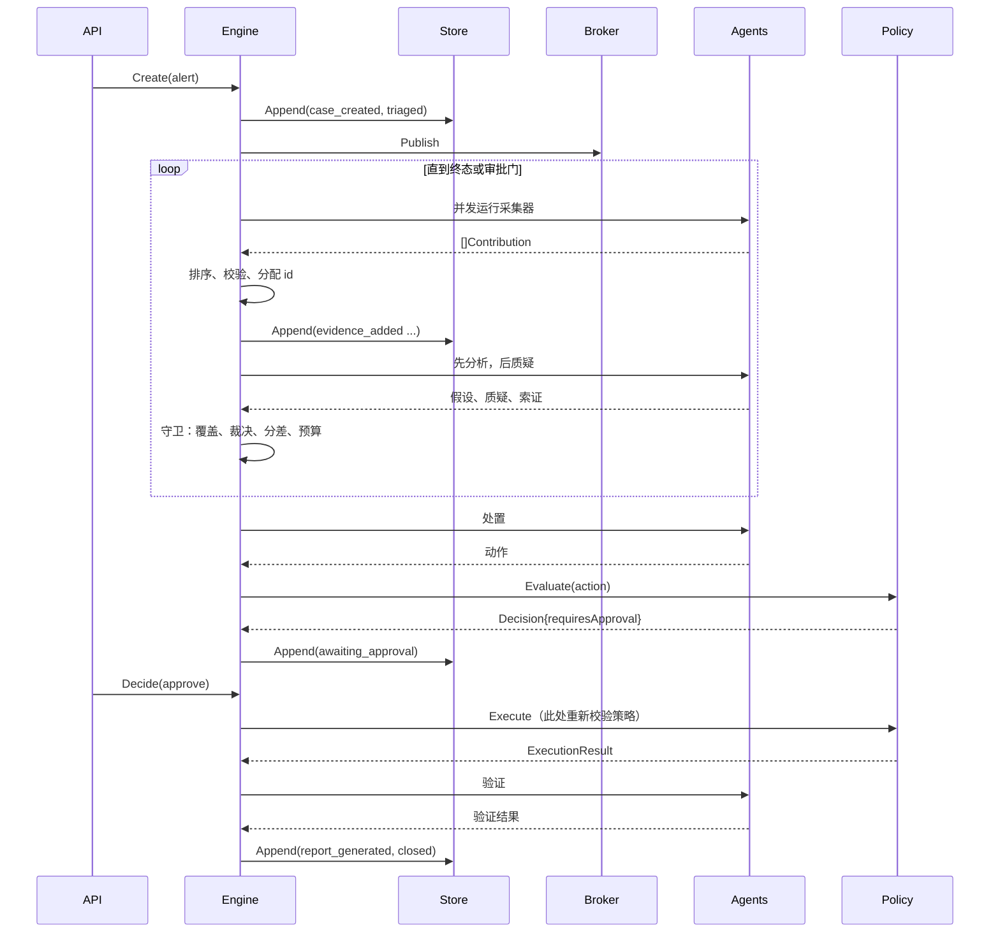

# IncidentOps Arena — 概要设计

## 1. 模块地图

本表中依赖方向严格向下。某个模块只能 import 位于它下方的模块。`domain` 除标准库外不
import 任何东西。

| 模块 | Go 包 | 平面 | 职责 | 依赖 |
|---|---|---|---|---|
| 入口 | `cmd/arena`、`cmd/evalctl`、`cmd/faultctl` | — | 装配适配器、解析参数、运行 | 全部 |
| HTTP API | `internal/httpapi` | 控制 | 路由、校验、SSE、控制台渲染 | orchestrator、store、report、eventbus、domain |
| 评估 | `internal/eval` | 控制 | 三种模式运行样例、计算指标 | orchestrator、agent、catalog、domain |
| 编排器 | `internal/orchestrator` | 控制 | 状态机、贡献应用、守卫、预算 | agent、policy、store、eventbus、domain |
| 事件分发器 | `internal/eventbus` | 控制 | 按订阅者扇出，游标可续传 | domain |
| 策略 | `internal/policy` | 控制 | 风险分级、白名单、执行授权 | signal、domain |
| 报告 | `internal/report` | 控制 | Markdown 与 JSON 报告渲染 | domain |
| 存储 | `internal/store` | 控制 | Case 索引、事件追加与区间读取 | domain |
| Agent | `internal/agent` | 推理 | 产出 contribution 的角色受限函数 | reasoner、signal、domain |
| 推理器 | `internal/reasoner` | 推理 | 假设形成、评分、质疑规则 | catalog、domain |
| 目录 | `internal/catalog` | 推理 | 内嵌故障签名与故障样例 | domain |
| 信号 | `internal/signal` | 信号 | 端口、上限、聚类、异常检测 | domain |
| 夹具适配器 | `internal/signal/fixture` | 信号 | 进程内确定性数据源 | signal、catalog、domain |
| 在线适配器 | `internal/signal/live` | 信号 | Prometheus、文件日志、发布历史 | signal、domain |
| 领域 | `internal/domain` | — | 实体、contribution 代数、事件折叠 | — |

一条架构测试会通过检查 import 来断言这个次序，因此 ARC-001 是被强制执行的，而不是被
提倡的。

## 2. 模块设计

<!-- sdd:item id=HLD-001 stage=hld status=approved derives_from=ARC-002 -->
### HLD-001 — 领域实体与确定性标识符

**目的。** 定义各平面之间交换的实体，以及让运行可复现的标识符方案。

**公开接口面。**

```go
type EvidenceKind string // metric | log | change | topology | knowledge | verification
type Evidence struct {
    ID         string
    Kind       EvidenceKind
    Agent      Role
    Source     string
    Window     TimeWindow
    Summary    string
    RawRef     string
    Confidence float64
    Truncated  bool
    Facts      map[string]string
}
func NewID(caseID string, role Role, seq int) string
```

**独占数据。** 无可变数据；实体皆为值。

**失败行为。** 构造函数校验取值范围并返回错误，而不是静默截断。

**细化自。** ARC-002

<!-- sdd:item id=HLD-002 stage=hld status=approved derives_from=ARC-002 -->
### HLD-002 — Contribution 代数与角色能力

**目的。** 成为"Agent 结论 → case 状态"的唯一通道，并编码哪些角色可以说哪些话。

**公开接口面。**

```go
type ContributionKind string
type Contribution struct {
    Kind         ContributionKind
    Evidence     *Evidence
    Hypothesis   *Hypothesis
    Critique     *Critique
    Demand       *EvidenceDemand
    Action       *Action
    Verification *VerificationResult
    Execution    *ExecutionResult
}
func (r Role) MayEmit(k ContributionKind) bool
func (c Contribution) Validate() error
```

**协作方。** 由 `agent` 产出，仅由 `orchestrator` 消费。

**失败行为。** 载荷与种类不匹配、或种类超出发出角色能力集合的 contribution，会以带类型的
错误被拒绝，编排器将其记录为事件。

**细化自。** ARC-002

<!-- sdd:item id=HLD-003 stage=hld status=approved derives_from=ARC-003 -->
### HLD-003 — 事件日志与 case 投影

**目的。** 让实时视图与重放视图成为同一次计算。

**公开接口面。**

```go
type Event struct {
    Seq      int
    CaseID   string
    Actor    Role
    Type     EventType
    Summary  string
    Ref      string
    Duration time.Duration
    At       time.Time
}
func Replay(caseID string, events []Event) (*Case, error)
func (c *Case) Apply(e Event) error
```

**独占数据。** `Case` 投影：状态、轮次、证据、假设、质疑、索证、动作、验证。

**失败行为。** 无法应用到当前投影的事件属于编程错误，并按错误返回；日志绝不会被部分应用。

**细化自。** ARC-003

<!-- sdd:item id=HLD-004 stage=hld status=approved derives_from=ARC-013 -->
### HLD-004 — 存储端口与适配器

**目的。** 在不绑定数据库的前提下持久化事件并索引 case。

**公开接口面。**

```go
type Store interface {
    CreateCase(ctx context.Context, c CaseHeader) error
    ListCases(ctx context.Context) ([]CaseHeader, error)
    Append(ctx context.Context, caseID string, events []Event) error
    Events(ctx context.Context, caseID string, fromSeq int) ([]Event, error)
}
```

**失败行为。** 每次调用的 Append 要么全成功要么全失败。文件适配器在启动时由目录重建索引，
把索引当作派生物。

**细化自。** ARC-013

<!-- sdd:item id=HLD-005 stage=hld status=approved derives_from=ARC-006 -->
### HLD-005 — 信号端口

**目的。** 定义通往外部世界的六条边界，以及每个结果都要经过的上限。

**公开接口面。**

```go
type MetricSource interface { Range(ctx, Query) (Series, error) }
type LogSource interface { Search(ctx, LogQuery) ([]LogLine, error) }
type ChangeSource interface { Changes(ctx, string, TimeWindow) ([]Change, error) }
type TopologySource interface { Neighbourhood(ctx, string) (Topology, error) }
type KnowledgeSource interface { Search(ctx, KnowledgeQuery) ([]Runbook, error) }
type Actuator interface { Invoke(ctx, ActionCall) (ActuationResult, error) }
type Bounds struct { MaxRows, MaxChars int; MaxSpan time.Duration }
```

**失败行为。** 返回量超过上限的端口会截断并报告截断；它绝不返回无界结果。

**细化自。** ARC-006

<!-- sdd:item id=HLD-006 stage=hld status=approved derives_from=ARC-006 -->
### HLD-006 — 夹具适配器与内嵌目录

**目的。** 让离线路径成为主路径，并由声明式数据驱动。

**公开接口面。**

```go
func LoadCatalog() (*Catalog, error)          // 内嵌的签名与故障样例
func NewFixtureSet(fc FaultCase) SignalSet    // 由一份样例定义生成全部六个端口
```

**协作方。** 由入口用于构建信号集合，也由评估运行器使用。

**细化自。** ARC-006

<!-- sdd:item id=HLD-007 stage=hld status=approved derives_from=ARC-005 -->
### HLD-007 — 推理器端口与规则适配器

**目的。** 把"Agent 得出什么结论"与"结论如何得出"分开。

**公开接口面。**

```go
type Reasoner interface {
    Hypothesise(ctx context.Context, s Snapshot) ([]Hypothesis, error)
    Critique(ctx context.Context, s Snapshot) ([]Critique, []EvidenceDemand, error)
}
func NewRuleReasoner(cat *Catalog, cfg Config) Reasoner
```

**失败行为。** 规则适配器不执行 I/O，因此不会因外部条件失败；无签名匹配时返回空假设列表，
编排器把它当作"证据不足"条件而非错误。

**细化自。** ARC-005

<!-- sdd:item id=HLD-008 stage=hld status=approved derives_from=ARC-008 -->
### HLD-008 — 评分

**目的。** 产出一个可被争论的数字。

**公开接口面。**

```go
type ScoreTerm struct { Name string; Weight, Value, Contribution float64 }
type ScoreBreakdown struct { Terms []ScoreTerm; Penalty, Total float64 }
func Score(h Hypothesis, ev []Evidence, w Weights) ScoreBreakdown
func Rank(hs []Hypothesis) []Hypothesis
```

**失败行为。** 无；对值的纯函数。权重合法性在加载时断言。

**细化自。** ARC-008

<!-- sdd:item id=HLD-009 stage=hld status=approved derives_from=ARC-009 -->
### HLD-009 — 质疑规则集合

**目的。** 赋予质疑者可独立测试、可单独归因的各项权力。

**公开接口面。**

```go
type CritiqueRule interface {
    Name() string
    Apply(s Snapshot, h Hypothesis) ([]Critique, []EvidenceDemand)
}
func DefaultRules(cat *Catalog, cfg Config) []CritiqueRule
```

**协作方。** 由规则推理器组合；每条规则都用恰好触发它的夹具做单元测试。

**"不触发"也是接口的一部分。** `Apply` 什么都不返回，是一个**决定**，而不是空操作；其中两条
规则依赖于此：规则必须能识别出"它要索取的证据其实已在手上"、"它要提出的对手其实已被反证
驳过"、"上一轮已经问过、而没有人能回答"，或"已经不剩任何一轮能让答案到达"。没有这一点，一条无人能回答的索证会在每一轮被重新
发出，领先者永远无法被接受——这套本用来使判断更锋利的集合，反而把案件卡死。因此每条规则的
**沉默**与它的反对意见一样要被测试。

**细化自。** ARC-009

<!-- sdd:item id=HLD-010 stage=hld status=approved derives_from=ARC-004 -->
### HLD-010 — Agent 角色

**目的。** 把角色、其端口与其推理器绑定成一个纯函数。

**公开接口面。**

```go
type Agent interface {
    Role() Role
    Run(ctx context.Context, s Snapshot) ([]Contribution, error)
}
func Collectors(sig SignalSet, cfg Config) []Agent
func Analysis(r Reasoner) Agent
func Critic(r Reasoner) Agent
func Remediation(cat *Catalog, cfg Config) Agent
func Verification(sig SignalSet, cfg Config) Agent
func SingleAgentBaseline(sig SignalSet, r Reasoner, cfg Config) Agent
```

**失败行为。** 端口错误以错误返回；编排器把它记录为事件，并用剩余采集器继续本轮。

**细化自。** ARC-004

<!-- sdd:item id=HLD-011 stage=hld status=approved derives_from=ARC-010 -->
### HLD-011 — 策略引擎与执行器

**目的。** 成为通往执行器的唯一路径，以及它之前的最后一道检查。

**公开接口面。**

```go
type Decision struct { Allowed bool; RequiresApproval bool; Rule, Reason string }
func (p *Engine) Evaluate(a Action) Decision
func (x *Executor) Execute(ctx context.Context, c *Case, a Action) (ExecutionResult, error)
```

**独占数据。** 执行器持有指向 `Actuator` 端口的唯一引用。

**失败行为。** `Execute` 会针对传入的动作重新评估策略，若判定不允许则以记录在案的理由
拒绝——无论审批状态如何。

**细化自。** ARC-010

<!-- sdd:item id=HLD-012 stage=hld status=approved derives_from=ARC-007,ARC-011 -->
### HLD-012 — 编排器

**目的。** 决定接下来发生什么，并成为唯一写入方。

**公开接口面。**

```go
type Engine struct { /* agents, policy, store, bus, config */ }
func (e *Engine) Create(ctx context.Context, alert Alert) (*Case, error)
func (e *Engine) Advance(ctx context.Context, caseID string) (*Case, error)
func (e *Engine) Run(ctx context.Context, caseID string) (*Case, error)
func (e *Engine) Decide(ctx context.Context, caseID, actionID string, d ApprovalDecision) (*Case, error)
```

**独占数据。** Case 状态、轮次计数器与标识符序列——其中包括每条索证首次被提出的轮次，正是
它让循环得以区分"还没人尝试过的索证"与"某轮尝试过、却无法回答的索证"。

**失败行为。** 非法迁移被拒绝并记录；`Run` 在审批门处停下并返回，而不是阻塞。

**细化自。** ARC-007, ARC-011

<!-- sdd:item id=HLD-013 stage=hld status=approved derives_from=ARC-012 -->
### HLD-013 — 事件分发器

**目的。** 让客户端可以观看，但不可能拖住一次调查。

**公开接口面。**

```go
func (b *Broker) Subscribe(caseID string, buffer int) (<-chan Event, func())
func (b *Broker) Publish(events ...Event)
```

**失败行为。** 缓冲写满的订阅者会被关闭并丢弃；publish 永不阻塞。

**细化自。** ARC-012

<!-- sdd:item id=HLD-014 stage=hld status=approved derives_from=ARC-014 -->
### HLD-014 — HTTP API

**目的。** 以 HTTP 暴露 case 生命周期，输入经校验、输出稳定。

**公开接口面。** `POST /api/cases`、`GET /api/cases`、`GET /api/cases/{id}`、
`GET /api/cases/{id}/events`、`GET /api/cases/{id}/stream`、
`POST /api/cases/{id}/actions/{actionID}/decision`、`GET /api/cases/{id}/report.md`、
`GET /api/cases/{id}/report.json`、`GET /healthz`。

**失败行为。** 校验错误返回 `400` 与 `{"error","field"}`；未知标识符返回 `404`；每个
响应都按确定顺序排列。

**细化自。** ARC-014

<!-- sdd:item id=HLD-015 stage=hld status=approved derives_from=ARC-014 -->
### HLD-015 — 控制台

**目的。** 在一个屏幕上让对抗过程可见。

**公开接口面。** `GET /` case 列表，`GET /cases/{id}` 工作台，含时间线、按类别分组的
证据、带分数拆解的排序假设、带裁决的质疑、带审批控件的动作，以及报告。

**失败行为。** 渲染失败返回 `500` 并附带 case 标识符；推流断开时实时区域降级为最后一次
服务端渲染的状态。

**细化自。** ARC-014

<!-- sdd:item id=HLD-016 stage=hld status=approved derives_from=ARC-003 -->
### HLD-016 — 报告生成

**目的。** 仅凭投影产出评审者阅读的文档。

**公开接口面。**

```go
func Markdown(c *Case) string
func JSON(c *Case) ([]byte, error)
```

**失败行为。** 对投影的纯函数；缺少某小节的 case 会把该小节明确渲染为"无"，而不是省略它。

**细化自。** ARC-003

<!-- sdd:item id=HLD-017 stage=hld status=approved derives_from=ARC-005 -->
### HLD-017 — 评估运行器

**目的。** 把多 Agent 的结论算出来，而不是宣称出来。

**公开接口面。**

```go
type Mode string // single | multi_no_critic | multi_with_critic
func RunCase(ctx context.Context, fc FaultCase, m Mode) (CaseOutcome, error)
func Summarise(outcomes []CaseOutcome) Report
```

**失败行为。** 失败的样例记为一行失败结果，而不是中止整轮运行。

**细化自。** ARC-005

<!-- sdd:item id=HLD-018 stage=hld status=approved derives_from=ARC-014 -->
### HLD-018 — 入口

**目的。** 依配置装配适配器，并提供运维命令。

**公开接口面。** `arena serve`、`arena demo`、`arena report`、`evalctl run`、
`faultctl inject|restore|status`。

**失败行为。** 配置错误以 `2` 退出并指明出错的键；运行期错误以 `1` 退出。

**细化自。** ARC-014

<!-- sdd:item id=HLD-019 stage=hld status=approved derives_from=ARC-006 -->
### HLD-019 — 在线信号适配器与配置档选择

**目的。** 用真实系统为指标端口与日志端口提供服务，同时不让推理平面——以及测试套件——
察觉到任何变化。

**公开接口面。**

```go
package prometheus
func New(endpoint string, opts Options) *Source      // 实现 signal.MetricSource

package containerlog
func New(host string, opts Options) *Source          // 实现 signal.LogSource

package profile
func Build(name string, fc FaultCase, cat *Catalog, b Bounds) (signal.Set, error)
```

**失败行为。** 在线适配器在够不到其后端时返回 `signal.SourceError`，其中指明端口与端点。
采集器把它记为降级数据源并继续；够不到的指标后端绝不会中止一次调查，因为一次不完整的
调查也比没有调查更有价值。

"缺失"与"零"始终区分开：`NaN`、陈旧标记或空结果都变成缺失的采样点，绝不会变成 `0.0`
读数。

**协作者。** 仅由入口（HLD-018）装配。推理平面与控制平面中没有任何东西引用这些包。

**细化自。** ARC-006

<!-- sdd:item id=HLD-020 stage=hld status=approved derives_from=ARC-005 -->
### HLD-020 — 基于模型的推理器适配器

**目的。** 只在"判断确实有帮助"的那一处——即证据支持哪些签名——用判断替代模式匹配，同时让
打分、反驳与处置原封不动地留在原地（ADR-007）。

**公开接口面。**

```go
package model
func New(endpoint, model string, cat *Catalog, cfg reasoner.Config, opts Options) *Reasoner
// 实现 reasoner.Reasoner
```

**失败行为。** 不可达的服务商、非 200 状态码或无法解析的响应体都返回
`model.ProviderError`。它绝不会被报告为空结果：空假设列表意味着"没有任何匹配"，而服务商
故障不得冒充这个结论。

响应内容是不可信的。引用了快照中不存在的证据标识符的假设会被丢弃；不在目录中的签名标识符
会被丢弃；落在封闭集合之外的裁决会被丢弃。丢弃是逐条进行的，因此一个坏条目不会让一份本可
使用的响应整体作废。

**协作者。** 仅由入口装配。分数来自 `reasoner.Score`，使用与规则适配器相同的权重，因此
无论排序由哪个适配器产生，它都保持可拆解、可争论。

**细化自。** ARC-005

## 3. 数据模型

| 实体 | 关键字段 | 归属模块 | 生命周期 |
|---|---|---|---|
| `CaseHeader` | id、alert、service、severity、status、createdAt | store | 创建一次，状态由事件投影得出 |
| `Event` | seq、caseID、actor、type、summary、ref、duration、at | store | 只追加，永不修改 |
| `Evidence` | id、kind、agent、source、window、summary、rawRef、confidence、truncated、facts | domain | 一经应用即不可变 |
| `Hypothesis` | id、claim、mechanism、supporting[]、counter[]、breakdown、status | domain | 分数与状态由新事件更新，而非原地修改 |
| `Critique` | id、hypothesisID、rule、category、challenge、verdict、demands[] | domain | 一经应用即不可变 |
| `EvidenceDemand` | id、descriptor、kind、reason、satisfiedBy | domain | 由后续证据事件标记为已满足 |
| `Action` | id、title、tool、args、risk、preconditions、rollback、verification、approval、execution | domain | 审批与执行以事件记录 |
| `VerificationResult` | signal、before、after、recovered | domain | 一经应用即不可变 |

## 4. 外部接口摘要

| 接口 | 类型 | 契约引用 |
|---|---|---|
| REST API | HTTP/JSON | HLD-014；错误为 `{"error","field"}` |
| 事件流 | HTTP/SSE | HLD-013；`Last-Event-ID` 从某序号续传 |
| 控制台 | HTTP/HTML | HLD-015 |
| Prometheus | HTTP/JSON 客户端 | `internal/signal/live`；仅在线档使用 |
| 执行器 | 进程内或 compose | HLD-011；只能经由执行器到达 |

## 5. 主流程时序



## 6. 设计评审检查表

- [x] 每个 ARC 条目至少有一个细化它的 HLD 条目
- [x] 每个模块只有一个变化原因
- [x] 每个端口都有离线适配器
- [x] 每个外部调用都规定了失败行为
- [x] 依赖表无环，并由测试断言
- [x] 只有编排器写入；只有执行器执行
